> 本笔记整理自小林coding《C++面试题》（https://xiaolincoding.com/interview/cpp.html），用于个人复习与分享，如涉侵权请联系删除。

# C++基础 笔记

本类覆盖指针、引用、const、static、struct/class、内存拷贝等 C++ 最核心的语言基础概念，是几乎每场 C++ 面试的必问起点，重点考查对底层机制是否真正理解。

### 什么是指针？指针的大小及用法？

- 指针是指向另外一种类型的复合类型。
- 在 64 位计算机中，指针占 8 个字节空间，无论它指向的是 int 还是 char。

```
#include<iostream>

using namespace std;

int main(){
    int *p = nullptr;
    cout << sizeof(p) << endl; // 8

    char *p1 = nullptr;
    cout << sizeof(p1) << endl; // 8
    return 0;
}
```

- 用法之一是指向普通对象，用 new 创建对象后由指针持有其地址。

```
#include <iostream>

using namespace std;

class A
{
};

int main()
{
    A *p = new A();
    return 0;
}
```

- 用法之二是指向常量对象，这种指针称为常量指针。

```
#include <iostream>
using namespace std;

int main(void)
{
    const int c_var = 10;
    const int * p = &c_var;
    cout << *p << endl;
    return 0;
}
```

- 用法之三是指向函数，这种指针称为函数指针。

```
#include <iostream>
using namespace std;

int add(int a, int b){
    return a + b;
}

int main(void)
{
    int (*fun_p)(int, int);
    fun_p = add;
    cout << fun_p(1, 6) << endl;
    return 0;
}
```

- 用法之四是指向对象成员，包括指向对象成员函数的指针和指向对象成员变量的指针，特别注意定义指向成员函数的指针时要标明指针所属的类。

```
#include <iostream>
using namespace std;

class A
{
public:
    int var1, var2;
    int add(){
        return var1 + var2;
    }
};

int main()
{
    A ex;
    ex.var1 = 3;
    ex.var2 = 4;

    int *p = &ex.var1; // 指向对象成员变量
    cout << *p << endl;

    int (A::*fun_p)(); // 成员函数指针
    fun_p = &A::add;   // 必须加 &

    cout << (ex.*fun_p)() << endl; // 调用成员函数
    return 0;
}
```

- 用法之五是 this 指针，它是指向类的当前对象的指针常量。

```
#include <iostream>
#include <cstring>
using namespace std;

class A
{
public:
    void set_name(string tmp)
    {
        this->name = tmp;
    }
    void set_age(int tmp)
    {
        this->age = tmp;
    }
    void set_sex(int tmp)
    {
        this->sex = tmp;
    }
    void show()
    {
        cout << "Name: " << this->name << endl;
        cout << "Age: " << this->age << endl;
        cout << "Sex: " << this->sex << endl;
    }

private:
    string name;
    int age;
    int sex;
};

int main()
{
    A *p = new A();
    p->set_name("Alice");
    p->set_age(16);
    p->set_sex(1);
    p->show();

    return 0;
}
```

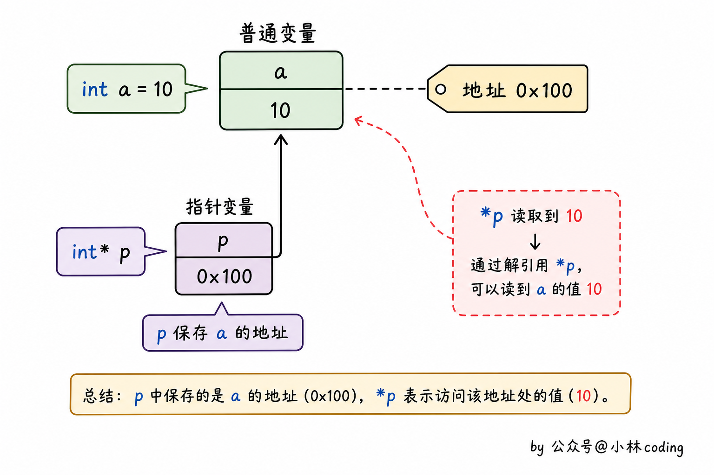
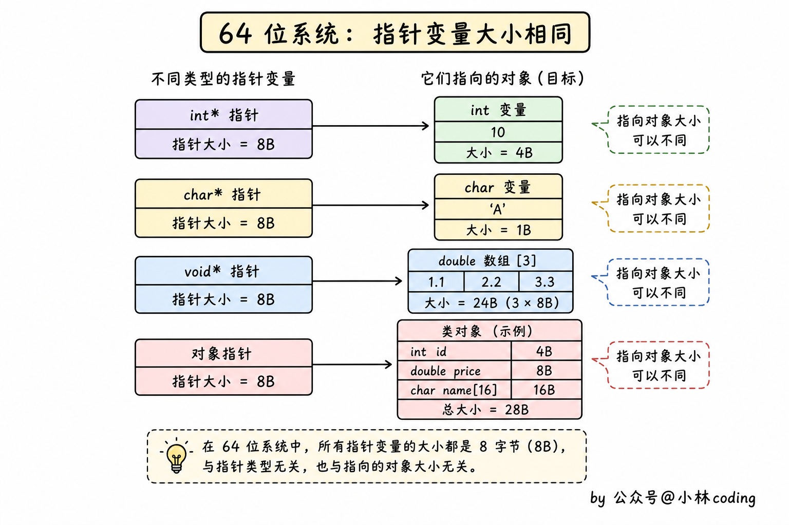
### 什么是野指针和悬空指针？

- 悬空指针是指指针原本指向一块内存空间，当这块内存空间被释放后，该指针依然指向这块内存空间的情况。

```
void *p = malloc(size);
free(p); 
// 此时，p 指向的内存空间已释放， p 就是悬空指针。
```

- 野指针是指不确定其指向的指针，未初始化的指针就是野指针。

```
void *p; 
// 此时 p 是“野指针”。
```

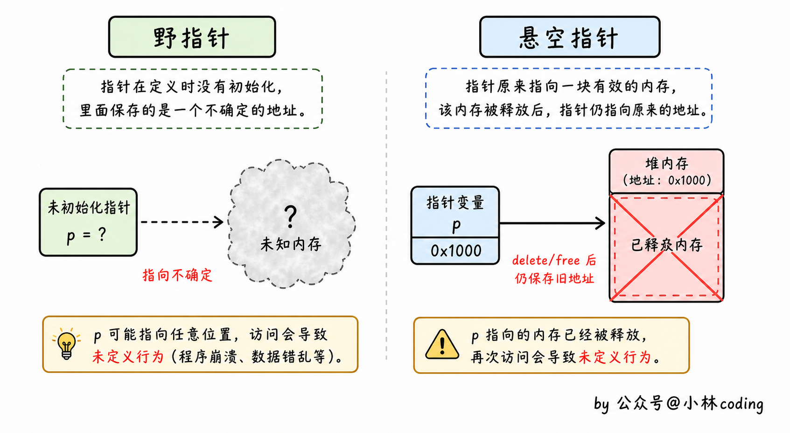
### 指针和引用的区别是什么？

- **是否可变**：指针所指向的内存空间在程序运行过程中可以改变，而引用所绑定的对象一旦绑定就不能改变。
- **是否占内存**：指针本身在内存中占有内存空间，引用相当于变量的别名，在内存中不占内存空间。
- **是否可为空**：指针可以为空，但是引用必须绑定对象。
- **是否能为多级**：指针可以有多级，但是引用只能一级。

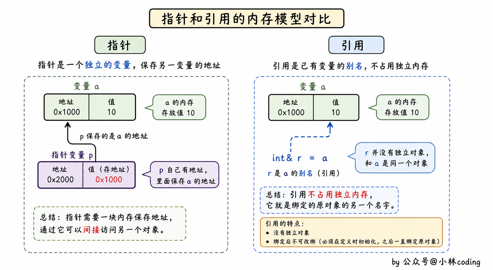
### 常量指针和指针常量的区别是什么？

- 常量指针本质上是个指针，只不过这个指针指向的对象是常量，即不可以通过对指针解引用修改指针指向的内容，但可以修改指针的指向。
- 常量指针的特点是 const 的位置在指针声明运算符 `*` 的左侧，只要 const 位于 `*` 的左侧，无论它在类型名的左边或右边，都表示指向常量的指针。
- 可以这样理解，`*` 左侧表示指针指向的对象，该对象为常量，那么该指针为常量指针。

```
const int * p;
int const * p;
```

- 注意点之一是指针指向的对象不能通过这个指针来修改，也就是说常量指针可以被赋值为变量的地址，之所以叫做常量指针，是限制了通过这个指针修改变量的值。

```
#include <iostream>
using namespace std;

int main()
{
    const int c_var = 8;
    const int *p = &c_var; 
    *p = 6;            // error: assignment of read-only location '* p'
    return 0;
}
```

- 注意点之二是虽然常量指针指向的对象不能变化，可是因为常量指针本身是一个变量，因此可以被重新赋值。

```
#include <iostream>
using namespace std;

int main()
{
    const int c_var1 = 8;
    const int c_var2 = 8;
    const int *p = &c_var1; 
    p = &c_var2;
    return 0;
}
```

- 指针常量的本质上是个常量，只不过这个常量的值是一个指针，它和常量指针恰恰相反，不可以修改指针的指向，但可以通过对指针解引用修改指针指向的内容。
- 指针常量的特点是 const 位于指针声明操作符右侧，表明该对象本身是一个常量，左侧表示该指针指向的类型，即以 `*` 为分界线，其左侧表示指针指向的类型，右侧表示指针本身的性质。

```
const int var;
int * const c_p = &var;
```

- 注意点之一是指针常量的值是指针，这个值因为是常量，所以指针本身不能改变。

```
#include <iostream>
using namespace std;

int main()
{
    int var, var1;
    int * const c_p = &var;
    c_p = &var1; // error: assignment of read-only variable 'c_p'
    return 0;
}
```

- 注意点之二是通过指针常量解引用得到的内容可以改变。

```
#include <iostream>
using namespace std;

int main()
{
    int var = 3;
    int * const c_p = &var;
    *c_p = 12; 
    return 0;
}
```

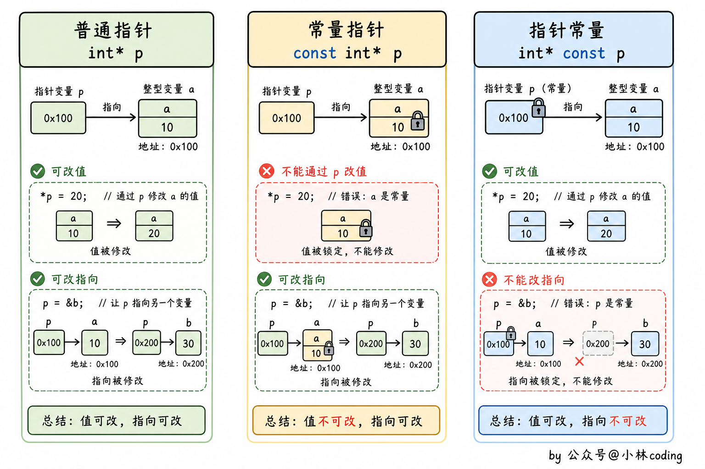
### 函数指针和指针函数的区别是什么？

- 指针函数本质是一个函数，只不过该函数的返回值是一个指针，相对于普通函数而言只是返回值是指针。

```
#include <iostream>
using namespace std;

struct Type
{
  int var1;
  int var2;
};

Type * fun(int tmp1, int tmp2){
    Type * t = new Type();
    t->var1 = tmp1;
    t->var2 = tmp2;
    return t;
}

int main()
{
    Type *p = fun(5, 6);
    return 0;
}
```

- 函数指针本质是一个指针变量，只不过这个指针指向一个函数，也就是指向函数的指针。

```
#include <iostream>
using namespace std;
int fun1(int tmp1, int tmp2)
{
  return tmp1 * tmp2;
}
int fun2(int tmp1, int tmp2)
{
  return tmp1 / tmp2;
}

int main()
{
  int (*fun)(int x, int y); 
  fun = fun1;
  cout << fun(15, 5) << endl; 
  fun = fun2;
  cout << fun(15, 5) << endl; 
  return 0;
}
/*
运行结果：
75
3
```

- **本质区别**：函数指针是个指针，是专门指向函数的指针变量，能存某个函数的地址，通过它能调用对应的函数；指针函数则是个函数，只是这个函数的返回值是指针类型，调用后会得到一个指针结果。
- **记忆口诀**：关键看名字最后俩字，「函数指针」的核心是指针，用来指向函数；「指针函数」的核心是函数，特点是返回指针，别被名字顺序迷惑。

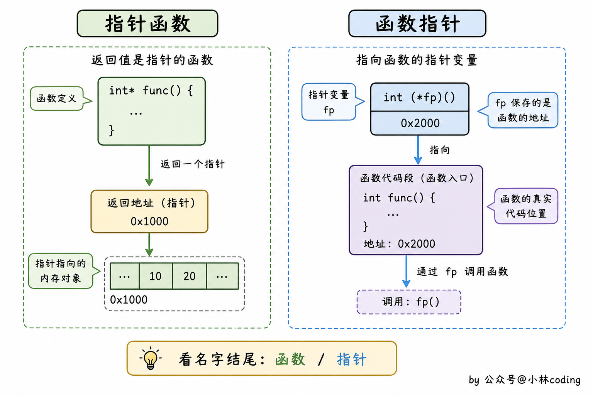
### 指针传递和引用传递的区别是什么？

- 指针传递时，形参会得到实参指针值的一份副本，形参指针和实参指针是两个不同的指针变量，但它们指向同一个对象。
- 通过解引用形参指针可以修改原对象，而仅改变形参指针自身的指向不会影响实参指针。
- 指针可以为空，也可以在函数中改为指向其他对象。
- 引用传递时，形参是实参对象的别名，不会产生一个独立的形参对象，通过形参进行的修改会直接作用于实参。
- 引用必须在定义时绑定到有效对象，并且绑定后不能再改为引用其他对象。
- 如果需要在函数内修改实参指针自身，可以传递指针的引用（如 T*&）或指向指针的指针（如 T**）。

### 函数传参用引用的作用是什么？

- 使用引用传参可以避免拷贝，从而避免对大型对象进行复制。
- 如果传递一个对象作为值参数，会触发对象的拷贝构造函数，造成额外的开销。
- 而使用引用传参，可以直接在函数中操作原始对象，避免了拷贝操作。

### 参数传递时，值传递、引用传递、指针传递的区别？

- 值传递时，形参是实参的拷贝，函数对形参的所有操作不会影响实参。
- 指针传递本质上是值传递，只不过拷贝的是指针的值，拷贝之后实参和形参是不同的指针，通过指针可以间接访问指针所指向的对象，从而可以修改它所指对象的值。
- 引用传递时，形参是引用类型，我们说它对应的实参被引用传递。

```
#include <iostream>
using namespace std;

void fun1(int tmp){ // 值传递
    cout << &tmp << endl;
}

void fun2(int * tmp){ // 指针传递
    cout << tmp << endl;
}

void fun3(int &tmp){ // 引用传递
    cout << &tmp << endl;
}

int main()
{
    int var = 5;
    cout << "var 在主函数中的地址：" << &var << endl;

    cout << "var 值传递时的地址：";
    fun1(var);

    cout << "var 指针传递时的地址：";
    fun2(&var);

    cout << "var 引用传递时的地址：";
    fun3(var);
    return 0;
}

/*
运行结果：
var 在主函数中的地址：0x23fe4c
var 值传递时的地址：0x23fe20
var 指针传递时的地址：0x23fe4c
var 引用传递时的地址：0x23fe4c
*/
```

- 从上述代码的运行结果可以看出，只有在值传递时，形参和实参的地址不一样，在函数体内操作的不是变量本身。
- 引用传递和指针传递，在函数体内操作的是变量本身。

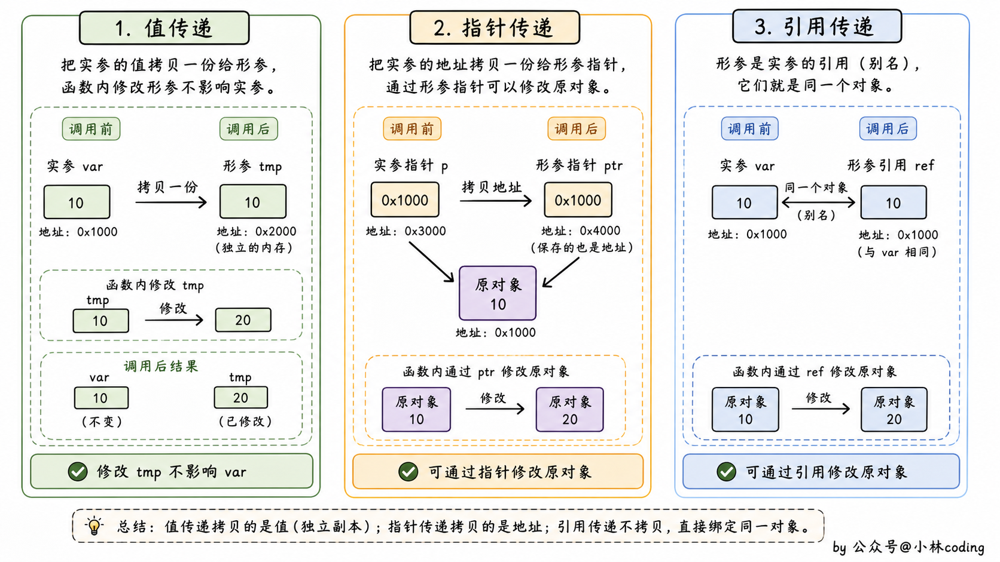
### C++全局变量、局部变量、静态全局变量、静态局部变量的区别？

- C++ 变量根据定义的位置不同具有不同的生命周期，也具有不同的作用域，作用域可分为 6 种，分别是全局作用域、局部作用域、语句作用域、类作用域、命名空间作用域和文件作用域。
- **全局变量**：具有全局作用域，只需在一个源文件中定义，就可以作用于所有的源文件。
- 其他不包含全局变量定义的源文件，需要用 extern 关键字再次声明这个全局变量。
- **静态全局变量**：具有文件作用域，它与全局变量的区别在于如果程序包含多个文件，它只作用于定义它的文件里，不能作用到其它文件里，即被 static 关键字修饰过的变量具有文件作用域。
- 这样即使两个不同的源文件都定义了相同名字的静态全局变量，它们也是不同的变量。
- **局部变量**：具有局部作用域，它是自动对象（auto），在程序运行期间不是一直存在，而是只在函数执行期间存在，函数的一次调用执行结束后，变量被撤销，其所占用的内存也被收回。
- **静态局部变量**：具有局部作用域，它只被初始化一次，自从第一次被初始化直到程序运行结束都一直存在。
- 静态局部变量和全局变量的区别在于，全局变量对所有的函数都是可见的，而静态局部变量只对定义自己的函数体始终可见。
- **从分配内存空间看**：全局变量、静态局部变量、静态全局变量都存放在静态存储区，局部变量存放在栈上。

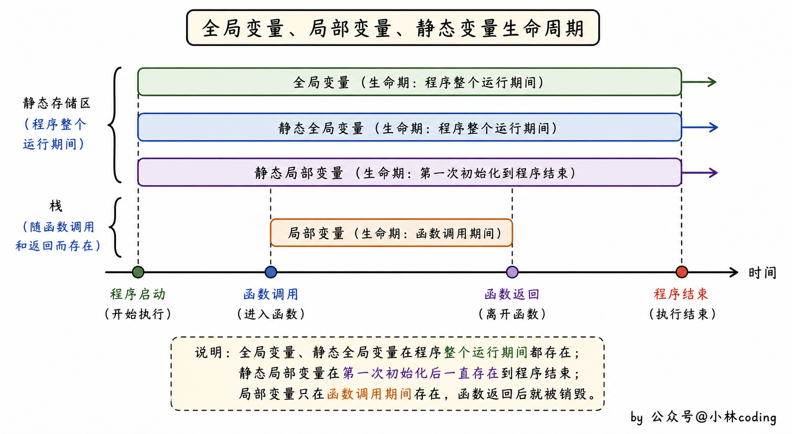
### 全局变量定义在头文件中有什么问题？

- 如果在头文件中定义全局变量，当该头文件被多个文件 include 时，该头文件中的全局变量就会被定义多次，导致重复定义。
- 因此不能在头文件中定义全局变量。

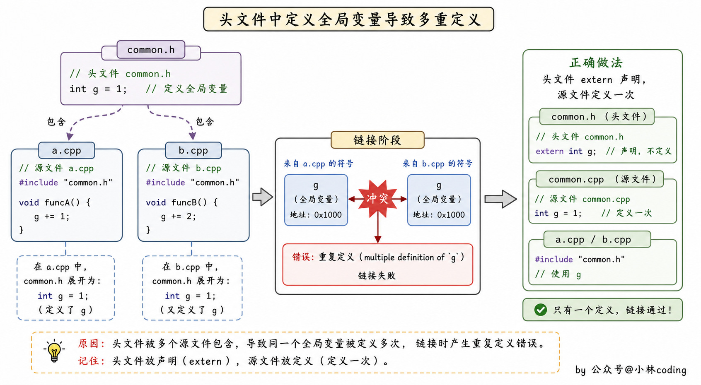
### extern C 的作用是什么？

- 当 C++ 程序需要调用 C 语言编写的函数时，C++ 使用链接指示，即 extern "C" 指出任意非 C++ 函数所用的语言。
- 举例来说，C++ 头文件 <cstring> 中就可能出现这样的链接指示。

```
// 可能出现在 C++ 头文件<cstring>中的链接指示
extern "C"{
    int strcmp(const char*, const char*);
}
```

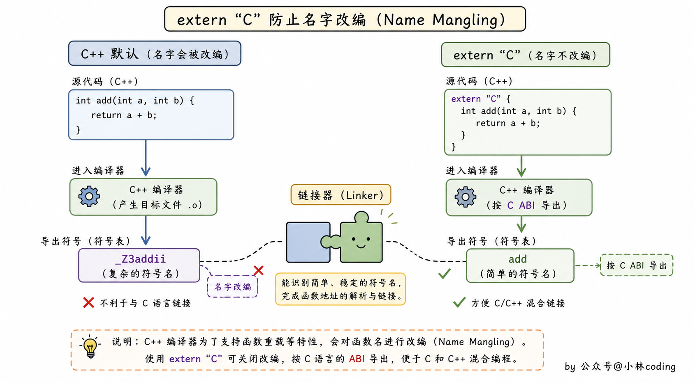
### sizeof(1==1) 在 C 和 C++ 中分别是什么结果？

- 在 C 语言中，关系运算的结果用 int 表示，因此 sizeof(1==1) 的结果是 4。

```
#include <stdio.h>

int main(void) {
    printf("%zu\n", sizeof(1 == 1));
    return 0;
}

/*
运行结果：
4
*/
```

- 在 C++ 中，关系运算的结果是 bool 类型，bool 占 1 个字节，因此 sizeof(1==1) 的结果是 1。

```
#include <iostream>
using namespace std;

int main() {
    cout << sizeof(1==1) << endl;
    return 0;
}

/*
1
*/
```

### C 和 C++ struct 的区别？

- 在 C 语言中 struct 是用户自定义数据类型；在 C++ 中 struct 是抽象数据类型，支持成员函数的定义。
- C 语言中 struct 没有访问权限的设置，是一些变量的集合体，不能定义成员函数；C++ 中 struct 可以和类一样，有访问权限，并可以定义成员函数。
- C 语言中 struct 定义的自定义数据类型，在定义该类型的变量时需要加上 struct 关键字，例如 `struct A var;` 定义 A 类型的变量；而 C++ 中不用加该关键字，例如 `A var;`。

### C++ 中 struct和Class区别是什么？

- 在 C++ 中，struct 和 class 是两种用于定义自定义数据类型的关键字，它们的核心功能相似，都能包含成员变量和成员函数，但存在一些关键区别，主要体现在默认访问权限和默认继承方式上。
- **默认访问权限不同**：struct 默认访问权限为 public，class 默认访问权限为 private。

```
struct A {
    int x;  // 默认 public，外部可直接访问
    void f() {}  // 默认 public，外部可调用
};

class B {
    int y;  // 默认 private，外部无法直接访问
    void g() {}  // 默认 private，外部无法直接调用
};

int main() {
    A a;
    a.x = 10;  // 合法（struct 成员默认 public）
    a.f();     // 合法

    B b;
    b.y = 20;  // 编译错误（class 成员默认 private）
    b.g();     // 编译错误
    return 0;
}
```

- **默认继承方式不同**：当使用继承时，两者的默认继承权限也不同，struct 默认继承方式为 public 继承，class 默认继承方式为 private 继承。

```
struct Base {
    int x;
};

// struct 默认 public 继承：Base 的 public 成员在 Derived1 中仍为 public
struct Derived1 : Base {
    // 可直接访问 Base::x，外部也可通过 Derived1 对象访问 x
};

// class 默认 private 继承：Base 的 public 成员在 Derived2 中变为 private
class Derived2 : Base {
    // 可直接访问 Base::x，但外部无法通过 Derived2 对象访问 x
};

int main() {
    Derived1 d1;
    d1.x = 10;  // 合法（public 继承）

    Derived2 d2;
    d2.x = 20;  // 编译错误（private 继承）
    return 0;
}
```

### 为什么有了 class 还保留 struct？

- C++ 是在 C 语言的基础上发展起来的，为了与 C 语言兼容，C++ 中保留了 struct。

### struct 和 union 的区别是什么？

- 说明一下，union 是联合体，struct 是结构体。
- **成员构成**：联合体和结构体都是由若干个数据类型不同的数据成员组成，但使用时联合体只有一个有效的成员，而结构体所有的成员都有效。
- **赋值影响**：对联合体的不同成员赋值，将会覆盖其他成员的值；而对于结构体的不同成员赋值时，相互不影响。
- **内存大小**：联合体的大小为其内部所有变量的最大值，按照最大类型的倍数进行分配大小；结构体分配内存的大小遵循内存对齐原则。

```
#include <iostream>
using namespace std;

typedef union
{
    char c[10];
    char cc1; // char 1 字节，按该类型的倍数分配大小
} u11;

typedef union
{
    char c[10];
    int i; // int 4 字节，按该类型的倍数分配大小
} u22;

typedef union
{
    char c[10];
    double d; // double 8 字节，按该类型的倍数分配大小
} u33;

typedef struct s1
{
    char c;   // 1 字节
    double d; // 1（char）+ 7（内存对齐）+ 8（double）= 16 字节
} s11;

typedef struct s2
{
    char c;   // 1 字节
    char cc;  // 1（char）+ 1（char）= 2 字节
    double d; // 2 + 6（内存对齐）+ 8（double）= 16 字节
} s22;

typedef struct s3
{
    char c;   // 1 字节
    double d; // 1（char）+ 7（内存对齐）+ 8（double）= 16 字节
    char cc;  // 16 + 1（char）+ 7（内存对齐）= 24 字节
} s33;

int main()
{
    cout << sizeof(u11) << endl; // 10
    cout << sizeof(u22) << endl; // 12
    cout << sizeof(u33) << endl; // 16
    cout << sizeof(s11) << endl; // 16
    cout << sizeof(s22) << endl; // 16
    cout << sizeof(s33) << endl; // 24

    cout << sizeof(int) << endl;    // 4
    cout << sizeof(double) << endl; // 8
    return 0;
}
```

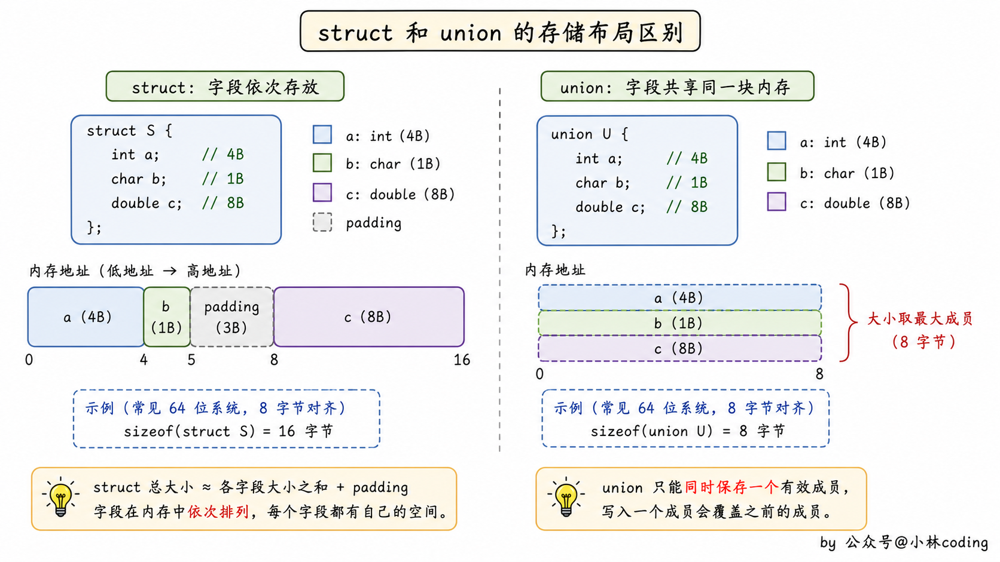
### class 和 struct 的异同是什么？

- struct 和 class 都可以自定义数据类型，也支持继承操作。
- struct 中默认的访问级别是 public，默认的继承级别也是 public；class 中默认的访问级别是 private，默认的继承级别也是 private。
- 当 class 继承 struct 或者 struct 继承 class 时，默认的继承级别取决于 class 或 struct 本身，即 class 为 private 继承，struct 为 public 继承，也就是取决于派生类的默认继承级别。

```
struct A{};
class B : A{}; // private 继承 
struct C : B{}; // public 继承
```

- 下面这个例子中，B 是 struct，所以它对 A 的默认继承级别为 public，C 是 class，所以它对 B 的默认继承级别为 private，于是外部无法通过 C 的对象访问 B 中的成员函数。

```
#include<iostream>

using namespace std;

class A{
public:
    void funA(){
        cout << "class A" << endl;
    }
};

struct B: A{ // 由于 B 是 struct，A 的默认继承级别为 public
public:
    void funB(){
        cout << "class B" << endl;
    }
};

class C: B{ // 由于 C 是 class，B 的默认继承级别为 private，所以无法访问基类 B 中的 printB 函数

};

int main(){
    A ex1;
    ex1.funA(); // class A

    B ex2;
    ex2.funA(); // class A
    ex2.funB(); // class B

    C ex3;
    ex3.funB(); // error: 'B' is not an accessible base of 'C'.
    return 0;
}
```

- 另外一点区别是，class 可以用于定义模板参数，struct 不能用于定义模板参数。

### C 和 C++ static 的区别是什么？

- 在 C 语言中，使用 static 可以定义局部静态变量、外部静态变量、静态函数。
- 在 C++ 中，使用 static 可以定义局部静态变量、外部静态变量、静态函数、静态成员变量和静态成员函数。
- 因为 C++ 中有类的概念，静态成员变量、静态成员函数都是与类有关的概念。

### C++ static作用是什么？

- static 用于定义静态变量和静态函数。
- **保持变量内容持久**：static 作用于局部变量，改变了局部变量的生存周期，使得该变量存在于定义后直到程序运行结束的这段时间。

```
#include <iostream>
using namespace std;

int fun(){
    static int var = 1; // var 只在第一次进入这个函数的时初始化
    var += 1;
    return var;
}
  
int main()
{
    for(int i = 0; i < 10; ++i)
    	cout << fun() << " "; // 2 3 4 5 6 7 8 9 10 11
    return 0;
}
```

- **隐藏**：static 作用于全局变量和函数，改变了全局变量和函数的作用域，使得全局变量和函数只能在定义它的文件中使用，在源文件中不具有全局可见性。
- 需要注意，普通全局变量和函数具有全局可见性，即其他的源文件也可以使用。
- static 作用于类的成员变量和类的成员函数，使得类变量或者类成员函数和类有关，也就是说可以不定义类的对象就可以通过类访问这些静态成员。
- 注意，类的静态成员函数中只能访问静态成员变量或者静态成员函数，不能将静态成员函数定义成虚函数。

```
#include<iostream>
using namespace std;

class A
{
private:
    int var;
    static int s_var; // 静态成员变量
public:
    void show()
    {
        cout << s_var++ << endl;
    }
    static void s_show()
    {
        cout << s_var << endl;
		// cout << var << endl; // error: invalid use of member 'A::a' in static member function. 静态成员函数不能调用非静态成员变量。无法使用 this.var
        // show();  // error: cannot call member function 'void A::show()' without object. 静态成员函数不能调用非静态成员函数。无法使用 this.show()
    }
};
int A::s_var = 1;  // 静态成员变量在类外进行初始化赋值，默认初始化为 0

int main()
{
    
    // cout << A::sa << endl;    // error: 'int A::sa' is private within this context
    A ex;
    ex.show();
    A::s_show();
}
```

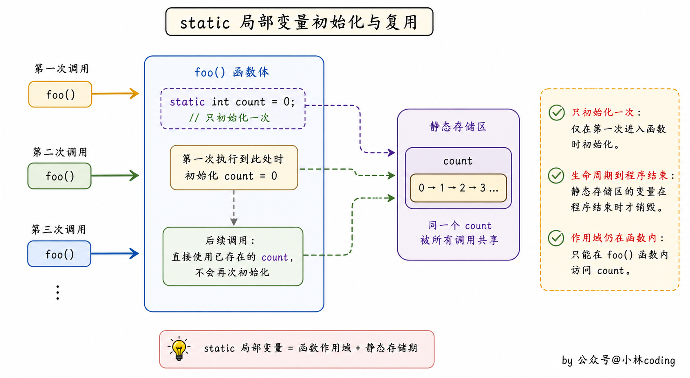
### static 在类中使用的注意事项有哪些？

- 静态成员变量是在类内进行声明，在类外进行定义和初始化，在类外进行定义和初始化的时候不要出现 static 关键字和 private、public、protected 访问规则。
- 静态成员变量相当于类域中的全局变量，被类的所有对象所共享，包括派生类的对象。
- 静态成员变量可以作为成员函数的参数，而普通成员变量不可以。

```
#include <iostream>
using namespace std;

class A
{
public:
    static int s_var;
    int var;
    void fun1(int i = s_var); // 正确，静态成员变量可以作为成员函数的参数
    void fun2(int i = var);   //  error: invalid use of non-static data member 'A::var'
};
int main()
{
    return 0;
}
```

- 静态数据成员的类型可以是所属类的类型，而普通数据成员的类型只能是该类类型的指针或引用。

```
#include <iostream>
using namespace std;

class A
{
public:
    static A s_var; // 正确，静态数据成员
    A var;          // error: field 'var' has incomplete type 'A'
    A *p;           // 正确，指针
    A &var1;        // 正确，引用
};

int main()
{
    return 0;
}
```

- 静态成员函数不能调用非静态成员变量或者非静态成员函数，因为静态成员函数没有 this 指针。
- 静态成员函数作为类作用域的全局函数。
- 静态成员函数不能声明成虚函数（virtual）、const 函数和 volatile 函数。

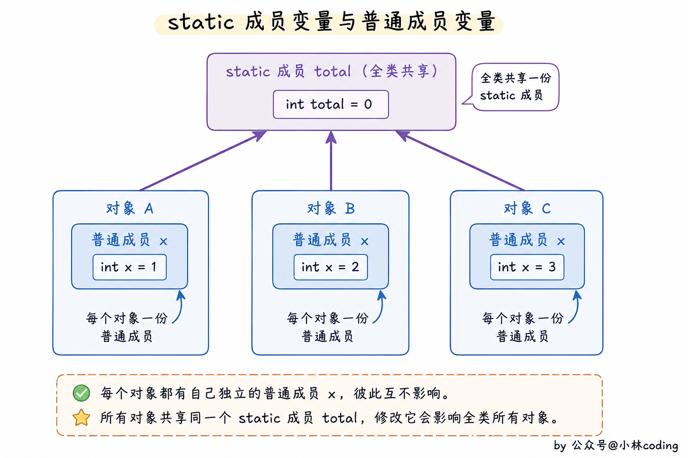
### static 全局变量和普通全局变量的异同是什么？

- **相同点之存储方式**：普通全局变量和 static 全局变量都是静态存储方式。
- **不同点之作用域**：普通全局变量的作用域是整个源程序，当一个源程序由多个源文件组成时，普通全局变量在各个源文件中都是有效的。
- 静态全局变量则限制了其作用域，即只在定义该变量的源文件内有效，在同一源程序的其它源文件中不能使用它。
- 由于静态全局变量的作用域限于一个源文件内，只能为该源文件内的函数公用，因此可以避免在其他源文件中引起错误。
- **不同点之初始化**：静态全局变量只初始化一次，防止在其他文件中使用。

### C++ 静态变量的使用场景是什么？未初始化的全局静态变量呢？

- 静态变量（包括全局静态、局部静态、类静态成员）的核心特点是生命周期贯穿程序运行始终，且作用域受限定。
- **全局静态变量**：作用是限制变量仅在当前文件内可见，避免不同文件中同名变量冲突，但生命周期是整个程序运行期间。
- 全局静态变量的典型场景是多个文件需要独立使用同名变量（如统计各模块的内部计数），但不希望被其他文件访问或修改，例如 `static int count = 0;` 仅当前 .cpp 文件可访问，其他文件即使声明 `extern int count` 也无法使用。
- **局部静态变量**：变量在函数第一次调用时初始化，后续调用不再重新初始化，值会被保留，生命周期全局，作用域仅限函数内。
- 局部静态变量的典型场景包括记录函数被调用的次数（如 `static int call_count = 0; call_count++;`）、单例模式中确保全局只存在一个实例（如函数内返回静态对象的指针），以及避免频繁创建销毁临时对象（如工具函数中复用的缓冲区）。
- **类静态成员变量**：属于整个类而非某个对象，所有对象共享该变量，生命周期全局，需在类外单独初始化。
- 类静态成员变量的典型场景包括统计类的实例数量（如 `static int total;`，在构造函数中 total++，析构函数中 total--），以及存储类级别的常量或共享配置（如 `static const int MAX_SIZE = 100;`）。
- **未初始化的全局静态变量之自动初始化**：编译器会将其默认初始化为 0，包括数值类型为 0，指针类型为 nullptr 等。
- 这是因为全局静态变量存放在内存的 BSS 段（未初始化数据段），程序启动时系统会自动将该段所有数据清零。
- **未初始化的全局静态变量之作用域限制**：和初始化的全局静态变量一样，仅在当前文件内可见，不影响其他文件的同名变量。

```
// file1.cpp
static int uninit;  // 未初始化，默认值为0，仅file1可见

// file2.cpp
static int uninit;  // 与file1的uninit无关，各自为0
```

- 未初始化的全局静态变量本质上是「带文件作用域的零初始化全局变量」，适合需要跨函数（但仅限当前文件）共享、且初始值为 0 的场景。

### 介绍const 作用及用法？

- const 修饰成员变量，定义成 const 常量，相较于宏常量，可进行类型检查，节省内存空间，提高了效率。
- const 修饰函数参数，使得传递过来的函数参数的值不能改变。
- const 修饰成员函数，使得成员函数不能修改任何类型的成员变量（mutable 修饰的变量除外），也不能调用非 const 成员函数，因为非 const 成员函数可能会修改成员变量。
- **在类中的用法之 const 成员变量**：const 成员变量只能在类内声明、定义，在构造函数初始化列表中初始化。
- const 成员变量只在某个对象的生存周期内是常量，对于整个类而言却是可变的，因为类可以创建多个对象，不同对象的 const 成员变量的值是不同的。
- 因此不能在类的声明中初始化 const 成员变量，因为类的对象还没有创建，编译器不知道它的值。
- **在类中的用法之 const 成员函数**：不能修改成员变量的值，除非有 mutable 修饰，并且只能访问成员变量。
- const 成员函数不能调用非常量成员函数，以防修改成员变量的值。

### define 和 const 的区别是什么？

- **编译阶段不同**：define 是在编译预处理阶段进行替换，const 是在编译阶段确定其值。
- **安全性不同**：define 定义的宏常量没有数据类型，只是进行简单的替换，不会进行类型安全的检查；const 定义的常量是有类型的，是要进行判断的，可以避免一些低级的错误。
- **内存占用不同**：define 定义的宏常量，在程序中使用多少次就会进行多少次替换，内存中有多个备份，占用的是代码段的空间；const 定义的常量占用静态存储区的空间，程序运行过程中只有一份。
- **调试不同**：define 定义的宏常量不能调试，因为在预编译阶段就已经进行替换了；const 定义的常量可以进行调试。
- **const 的优点总结**：有数据类型，在定义时可进行安全性检查，可以调试，并且占用较少的空间。

### define 和 typedef 的区别是什么？

- **原理不同**：#define 作为预处理指令，在编译预处理时进行替换操作，不作正确性检查，只有在编译已被展开的源程序时才会发现可能的错误并报错。
- typedef 是关键字，在编译时处理，有类型检查功能，用来给一个已经存在的类型一个别名，但不能在一个函数定义里面使用 typedef。
- **功能不同**：typedef 用来定义类型的别名，方便使用；#define 不仅可以为类型取别名，还可以定义常量、变量、编译开关等。
- **作用域不同**：#define 没有作用域的限制，只要是之前预定义过的宏，在以后的程序中都可以使用，而 typedef 有自己的作用域。
- **指针的操作不同**：typedef 和 #define 在处理指针时不完全一样。

```
#include <iostream>
#define INTPTR1 int *
typedef int * INTPTR2;

using namespace std;

int main()
{
    INTPTR1 p1, p2; // p1: int *; p2: int
    INTPTR2 p3, p4; // p3: int *; p4: int *

    int var = 1;
    const INTPTR1 p5 = &var; // 相当于 const int * p5; 常量指针，即不可以通过 p5 去修改 p5 指向的内容，但是 p5 可以指向其他内容。
    const INTPTR2 p6 = &var; // 相当于 int * const p6; 指针常量，不可使 p6 再指向其他内容。
    
    return 0;
}
```

### volatile 的作用？是否具有原子性，对编译器有什么影响？

- volatile 的作用是，当对象的值可能在程序的控制或检测之外被改变时，应该将该对象声明为 volatile，告知编译器不应对这样的对象进行优化。
- volatile 不具有原子性。
- volatile 对编译器的影响是，使用该关键字后编译器不会对相应的对象进行优化，即不会将变量从内存缓存到寄存器中，防止多个线程有可能使用内存中的变量、有可能使用寄存器中的变量，从而导致程序错误。

### 什么情况下一定要用 volatile， 能否和 const 一起使用？

- 当多个线程都会用到某一变量，并且该变量的值有可能发生改变时，需要用 volatile 关键字对该变量进行修饰。
- 中断服务程序中访问的变量或并行设备的硬件寄存器的变量，最好用 volatile 关键字修饰。
- volatile 关键字和 const 关键字可以同时使用，某种类型可以既是 volatile 又是 const，同时具有二者的属性。

### 为什么一般将析构函数设置为虚函数？

- 析构函数被设为虚函数主要是为了解决基类指针指向派生类对象时的资源释放问题。
- 如果我们有一个基类指针，它实际上指向一个派生类对象，当我们删除这个基类指针时，如果析构函数不是虚函数，那么就只会调用基类的析构函数，而不会调用派生类的析构函数。
- 这可能会导致派生类对象的一些资源没有被正确释放，从而引发内存泄漏等问题。
- 如果我们将析构函数设置为虚函数，那么在删除基类指针时，会首先调用派生类的析构函数，然后再调用基类的析构函数，从而确保所有的资源都能被正确释放。

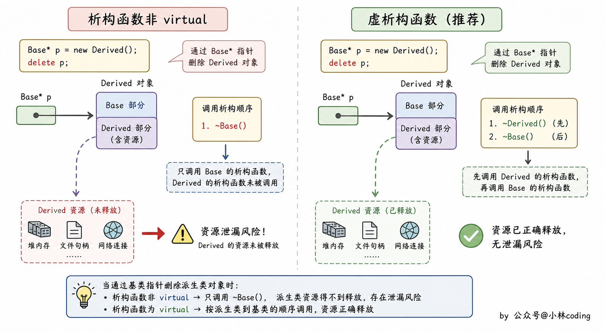
### 析构函数为什么通常是会做成一个虚函数呢？

- 如果一个类有虚函数，就应该为其定义一个虚析构函数。
- 这是因为在使用 delete 操作符释放一个指向派生类对象的基类指针时，如果基类的析构函数不是虚函数，那么只会调用基类的析构函数，而不会调用派生类的析构函数，这样就会导致内存泄漏和未定义行为的问题。
- 通过将析构函数定义为虚函数，可以确保在释放派生类对象时，先调用派生类的析构函数，再调用基类的析构函数，从而避免内存泄漏和未定义行为的问题。

### 为什么析构函数一般写为虚函数？

- 如果析构函数不被声明成虚函数，则编译器实施静态绑定，在删除基类指针时，只会调用基类的析构函数而不调用派生类析构函数。
- 这样就会造成派生类对象析构不完全，造成内存泄漏。
- 所以在实现多态时，当用基类操作派生类，在析构时防止只析构基类而不析构派生类的状况发生，要将基类的析构函数声明为虚函数。

### 为什么构造函数不写为虚函数？

- **从存储空间角度**：虚函数对应一个 vtable，可是这个 vtable 其实是存储在对象的内存空间的，如果构造函数是虚的，就需要通过 vtable 来调用，可是对象还没有实例化，也就是内存空间还没有，无法找到 vtable，所以构造函数不能是虚函数。
- **从使用角度**：虚函数的作用在于通过父类的指针或者引用来调用它的时候能够变成调用子类的那个成员函数。
- 而构造函数是在创建对象时自动调用的，不可能通过父类的指针或者引用去调用，因此也就规定构造函数不能是虚函数。

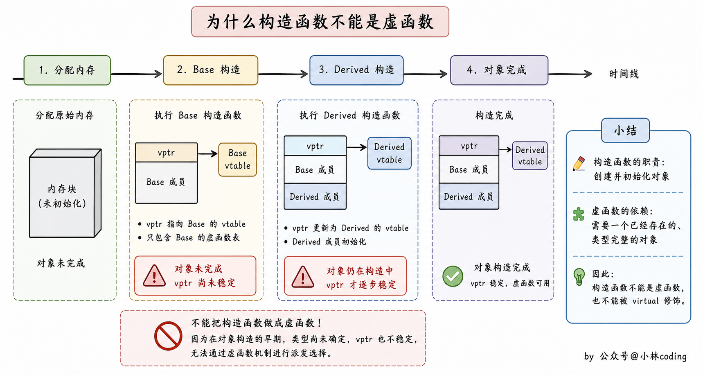
### 什么是内联函数？

- 在 C++ 中，使用关键字 inline 可以声明一个内联函数。
- 声明为内联函数的函数会在编译时被视为候选项，编译器会尝试将其展开，将函数体直接插入到调用点处。
- 这样可以避免函数调用的开销，减少了函数调用的栈帧等额外开销，从而提高程序的执行效率。

### 宏定义（define）和内联函数（inline）的区别是什么？

- 内联函数是在编译时展开，而宏在编译预处理时展开。
- 在编译的时候，内联函数直接被嵌入到目标代码中去，而宏只是一个简单的文本替换。
- 内联函数是真正的函数，和普通函数调用的方法一样，在调用点处直接展开，避免了函数的参数压栈操作，减少了调用的开销。
- 而宏定义编写较为复杂，常需要增加一些括号来避免歧义。
- 宏定义只进行文本替换，不会对参数的类型、语句能否正常编译等进行检查。
- 而内联函数是真正的函数，会对参数的类型、函数体内的语句编写是否正确等进行检查。

```
#include <iostream>

#define MAX(a, b) ((a) > (b) ? (a) : (b))

using namespace std;

inline int fun_max(int a, int b)
{
    return a > b ? a : b;
}

int main()
{
    int var = 1;
    cout << MAX(var, 5) << endl;     
    cout << fun_max(var, 0) << endl; 
    return 0;
}
/*
程序运行结果：
5
1

*/
```

### 内联函数有什么缺点？

- **代码膨胀**：内联函数会在每个调用它的地方进行代码替换，这可能导致代码膨胀，如果内联函数体非常大或者被频繁调用，会增加可执行文件的大小，可能导致缓存不命中，影响性能。
- **编译时间增加**：内联函数需要在每个调用点进行代码替换，这会增加编译时间，特别是当内联函数被广泛使用时，编译时间可能会显著增加。
- **头文件膨胀与维护成本增加**：由于内联展开需要在编译期就能看到函数定义，内联函数（尤其是跨文件使用的）通常需要把完整定义写在头文件中，而不是只放声明。
- 这会暴露实现细节、使头文件变得臃肿，并且一旦修改实现，所有包含该头文件的源文件都要重新编译，增加了维护成本。

### include “ “ 和 <> 的区别是什么？

- **查找文件的位置不同**：`#include <文件名>` 在标准库头文件所在的目录中查找，如果没有，再到当前源文件所在目录下查找。
- `#include "文件名"` 在当前源文件所在目录中进行查找，如果没有，再到系统目录中查找。
- **使用习惯不同**：对于标准库中的头文件常用 `#include <文件名>`，对于自己定义的头文件，常用 `#include "文件名"`。

### void*是什么?

- void* 是一种通用的指针类型，被称为「无类型指针」。
- 它可以用来表示指向任何类型的指针，因为 void* 指针没有指定特定的数据类型。
- 由于 void* 是无类型的，它不能直接进行解引用操作，也不能进行指针运算。
- 在使用 void* 指针时，需要将其转换为具体的指针类型才能进行操作。
- void* 指针常用于需要在不同类型之间进行通用操作的情况，例如在函数中传递任意类型的指针参数或在动态内存分配中使用。

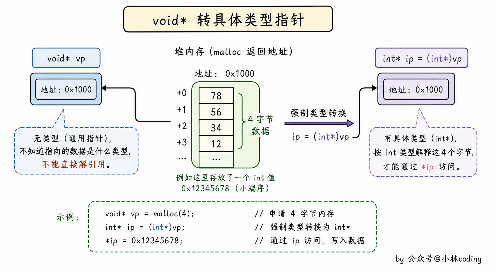
### malloc的参数列表 void*怎么转化为int*的？

- 可以使用类型转换将 void* 指针转化为 int* 指针。

```
void* voidPtr = malloc(sizeof(int));  // 分配内存并返回void*指针
int* intPtr = (int*)voidPtr;           // 将void*指针转化为int*指针

// 现在可以通过intPtr指针访问int类型的数据
*intPtr = 42;
```

- 在上述示例中，使用 malloc 函数分配了存储一个 int 类型数据所需的内存，并返回了一个 void* 指针。
- 然后，通过将 void* 指针转换为 int* 指针，将其赋值给 intPtr 变量，现在就可以通过 intPtr 指针访问和操作 int 类型的数据。

### sizeof 和 strlen 的区别是什么？

- strlen 是头文件 <cstring> 中的函数，sizeof 是 C++ 中的运算符。
- strlen 测量的是字符串的实际长度，以 \0 结束；而 sizeof 测量的是字符数组的分配大小。
- 下面是 strlen 的源代码实现。

```
strlen 源代码:
size_t strlen(const char *str) {
    size_t length = 0;
    while (*str++)
        ++length;
    return length;
}
```

```
#include <iostream>
#include <cstring>

using namespace std;

int main()
{
    char arr[10] = "hello";
    cout << strlen(arr) << endl; // 5
    cout << sizeof(arr) << endl; // 10
    return 0;
}
```

- 若字符数组 arr 作为函数的形参，sizeof(arr) 中 arr 被当作字符指针来处理，strlen(arr) 中 arr 依然是字符数组，从下述程序的运行结果中就可以看出。

```
#include <iostream>
#include <cstring>

using namespace std;

void size_of(char arr[])
{
    cout << sizeof(arr) << endl; // warning: 'sizeof' on array function parameter 'arr' will return size of 'char*' .
    cout << strlen(arr) << endl; 
}

int main()
{
    char arr[20] = "hello";
    size_of(arr); 
    return 0;
}
/*
输出结果：
8
5
*/
```

- strlen 本身是库函数，因此在程序运行过程中计算长度；而 sizeof 在编译时计算长度。
- sizeof 的参数可以是类型，也可以是变量；strlen 的参数必须是 char* 类型的变量。

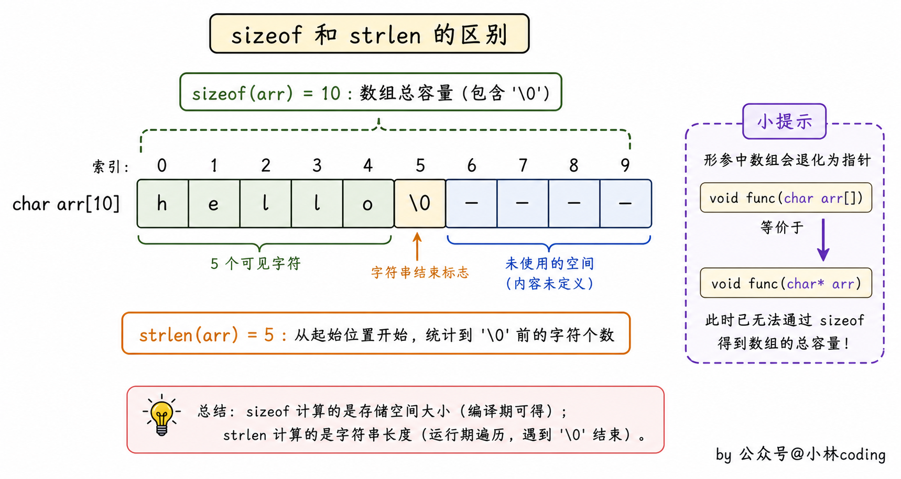
### explicit 的作用是什么？

- explicit 的作用是声明类的构造函数是显式调用的，而非隐式调用，可以阻止调用构造函数时进行隐式转换。
- explicit 只可用于修饰单参构造函数，因为无参构造函数和多参构造函数本身就是显式调用的，再加上 explicit 关键字也没有什么意义。
- 下面是不加 explicit 时发生隐式转换的例子。

```
#include <iostream>
using namespace std;

class A {
public:
    int var;
    A(int tmp) {
        var = tmp;
    }
};

int main() {
    A ex = 10; // 发生了隐式转换
    return 0;
}
```

- 上述代码中，`A ex = 10;` 在编译时进行了隐式转换，将 10 转换成 A 类型的对象，然后将该对象赋值给 ex。
- 为了避免隐式转换，可用 explicit 关键字进行声明。

```
#include <iostream>
using namespace std;

class A {
public:
    int var;
    explicit A(int tmp) {
        var = tmp;
        cout << var << endl;
    }
};

int main() {
    A ex(100);
    A ex1 = 10; // error: conversion from 'int' to non-scalar type 'A' requested
    return 0;
}
```

### memcpy 函数的底层原理是什么？

- memcpy 函数的底层原理简单说就是直接操作内存块的二进制数据。
- 它会从源地址开始，逐个字节（或按更高效的块）复制数据到目标地址，直到复制完指定的字节数。
- 底层实现通常会做优化，比如对对齐的内存块用更大的单位（如 4 字节、8 字节）批量复制，比单字节循环更快。
- 对未对齐的部分先用单字节处理到对齐位置，再用块复制。
- 整个过程不关心数据类型，纯粹按字节搬运，所以复制后目标内存和源内存的二进制内容完全一致，但不会处理像字符串结束符这类特殊情况。

```
void *memcpy(void *dst, const void *src, size_t size)
{
    char *psrc;
    char *pdst;

    if (NULL == dst || NULL == src)
    {
        return NULL;
    }

    if ((src < dst) && (char *)src + size > (char *)dst) // 出现地址重叠的情况，自后向前拷贝
    {
        psrc = (char *)src + size - 1;
        pdst = (char *)dst + size - 1;
        while (size--)
        {
            *pdst-- = *psrc--;
        }
    }
    else
    {
        psrc = (char *)src;
        pdst = (char *)dst;
        while (size--)
        {
            *pdst++ = *psrc++;
        }
    }

    return dst;
}
```

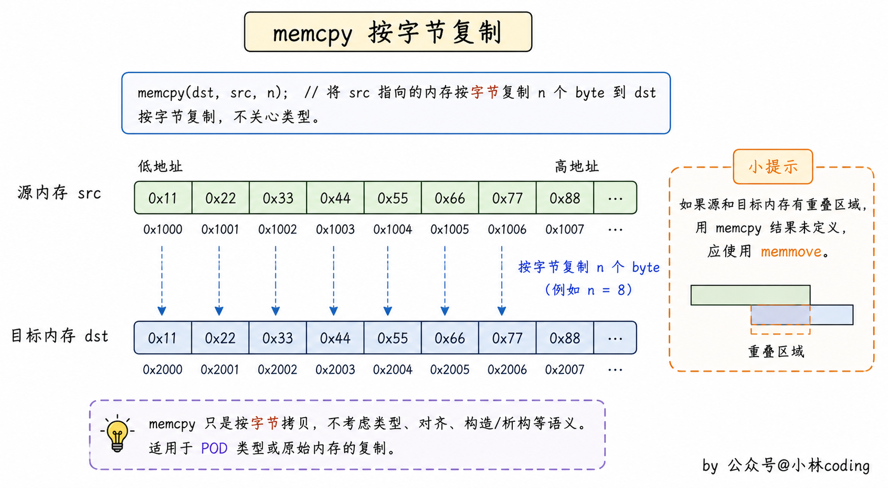
### strcpy 函数有什么缺陷？

- strcpy 函数不检查目的缓冲区的大小边界，而是将源字符串逐一地全部赋值给目的字符串地址起始的一块连续的内存空间，同时加上字符串终止符，会导致其他变量被覆盖。

```
#include <iostream>
#include <cstring>
using namespace std;

int main()
{
    int var = 0x11112222;
    char arr[10];
    cout << "Address : var " << &var << endl;
    cout << "Address : arr " << &arr << endl;
    strcpy(arr, "hello world!");
    cout << "var:" << hex << var << endl; // 将变量 var 以 16 进制输出
    cout << "arr:" << arr << endl;
    return 0;
}

/*
Address : var 0x23fe4c
Address : arr 0x23fe42
var:11002164
arr:hello world!
*/
```

- 从上述代码中可以看出，变量 var 的后六位被字符串 "hello world!" 的 "d!\0" 这三个字符改变，这三个字符对应的 ascii 码的十六进制为：\0(0x00)，!(0x21)，d(0x64)。
- 原因在于变量 arr 只分配了 10 个内存空间，通过上述程序中的地址可以看出 arr 和 var 在内存中是连续存放的。
- 但是在调用 strcpy 函数进行拷贝时，源字符串 "hello world!" 所占的内存空间为 13，因此在拷贝的过程中会占用 var 的内存空间，导致 var 的后六位被覆盖。

## 速记要点

- 指针在 64 位机器上占 8 字节，常见用法包括指向普通对象、常量对象、函数、对象成员以及 this 指针，野指针是未初始化的指针，悬空指针是所指内存已被释放的指针。
- 引用是别名、不占内存、必须绑定且不可改绑，而指针占内存、可为空、可多级、可改指向。
- 常量指针是 const 在 `*` 左侧，指向的内容不可改但指向可改；指针常量是 const 在 `*` 右侧，指向不可改但内容可改。
- 值传递是实参的拷贝，指针传递本质也是值传递，只有引用传递和指针传递能在函数体内修改原变量。
- sizeof 是编译期运算符，C 中 sizeof(1==1) 结果为 4 而 C++ 中为 1；strlen 是运行期库函数，只认 char* 并以 \0 为结束标志。
- struct 默认 public 访问和 public 继承，class 默认 private 访问和 private 继承，混合继承时看派生类的默认继承级别。
- union 所有成员共用同一块内存，同一时刻只有一个成员有效，大小按最大成员并对齐；struct 成员各自独立并遵循内存对齐。
- static 修饰局部变量延长生命周期，修饰全局变量和函数则限制其只在当前文件可见，静态成员函数没有 this 指针且不能是虚函数。
- const 常量有类型、可调试、只占一份静态存储区，而 define 宏在预处理阶段无类型替换且不可调试。
- 基类析构函数必须是虚函数，否则用基类指针删除派生类对象只会调用基类析构，造成内存泄漏；构造函数则不能是虚函数。

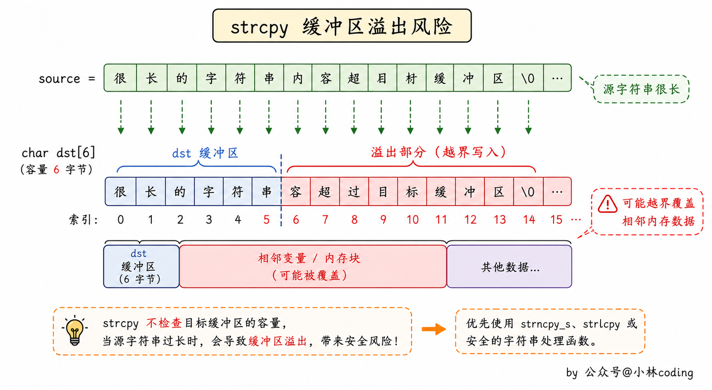
