> 本笔记整理自小林coding《C++面试题》（https://xiaolincoding.com/interview/cpp.html），用于个人复习与分享，如涉侵权请联系删除。

# C++ 类相关 笔记

类的缺省函数、虚函数与纯虚函数、虚函数表结构以及 sizeof 类大小计算，是 C++ 面试中最容易追问到底的一组硬核考点。

### class中缺省的函数是什么？

- 在 C++ 中，如果一个类没有显式地定义构造函数、析构函数、拷贝构造函数、赋值运算符重载函数，那么编译器会自动生成这些函数。
- 这些由编译器自动生成的函数被称为缺省函数。

### 什么是纯虚函数？有哪些应用场景

- 纯虚函数是在基类中声明的虚函数，它在基类中没有定义，但要求任何派生类都要定义自己的实现方法。
- 在 C++ 中，纯虚函数的声明形式是在虚函数声明的末尾加上 `= 0`。

```
virtual void function() = 0;
```

- 其中，`= 0` 就表示这是一个纯虚函数，含有纯虚函数的类被称为抽象类。
- 抽象类不能被实例化，只能作为接口使用，派生类必须实现所有的纯虚函数，否则该派生类也会变成抽象类。
- **设计模式场景**：例如在模板方法模式中，基类定义一个算法的骨架，而将一些步骤延迟到子类中，这些需要在子类中实现的步骤就可以声明为纯虚函数。
- **接口定义场景**：可以创建一个只包含纯虚函数的抽象类作为接口，所有实现该接口的类都必须提供这些函数的实现。

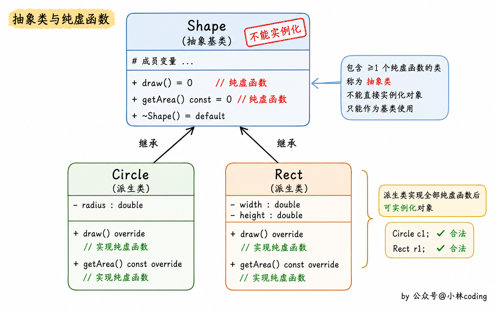
### 什么是虚函数？什么是纯虚函数？

- 虚函数就是被 virtual 关键字修饰的成员函数。

```
#include <iostream>
using namespace std;

class A
{
public:
    virtual void v_fun() // 虚函数
    {
        cout << "A::v_fun()" << endl;
    }
};
class B : public A
{
public:
    void v_fun()
    {
        cout << "B::v_fun()" << endl;
    }
};
int main()
{
    A *p = new B();
    p->v_fun(); // B::v_fun()
    return 0;
}
```

- 纯虚函数在类中声明时，需要在函数声明后加上 `=0`。
- 含有纯虚函数的类称为抽象类，只要含有纯虚函数这个类就是抽象类，类中只有接口，没有具体的实现方法。
- 继承纯虚函数的派生类，如果没有完全实现基类的纯虚函数，依然是抽象类，不能实例化对象。
- 抽象类对象不能作为函数的参数，不能创建对象，也不能作为函数返回类型。
- 可以声明抽象类的指针，也可以声明抽象类的引用。
- 子类必须继承父类的纯虚函数，并全部实现后，才能创建子类的对象。

### 虚函数和纯虚函数的区别？

- **定义形式不同**：虚函数在普通函数的基础上加上 virtual 关键字；纯虚函数除了加上 virtual 关键字外，还需要在函数声明后加上 `=0`。
- **是否提供实现不同**：虚函数在基类中必须有自己的实现，也就是提供一个默认实现，派生类可以选择重写它，也可以不重写而直接沿用基类的默认实现；纯虚函数在基类中只有声明、没有实现（也可以另外提供实现，但这并非必须），它表示的只是一个接口。
- **派生类是否必须实现不同**：虚函数派生类可以不重写；而纯虚函数要求派生类必须将其全部实现（重写），否则派生类依然是抽象类，无法实例化对象。
- **所属类不同**：含有纯虚函数的类称为抽象类（抽象基类），不能创建对象；只含有普通虚函数而不含纯虚函数的类则可以正常实例化。
- 虚函数和纯虚函数也可以出现在同一个类中，此时该类同样是抽象类。
- 对于实现了纯虚函数的派生类，该函数在派生类中就成为了普通的虚函数，虚函数和纯虚函数都可以在派生类中继续被重写。
- 析构函数最好定义为虚函数，特别是对于含有继承关系的类。
- 析构函数也可以定义为纯虚函数，此时其所在的类为抽象基类，不能创建实例化对象，但纯虚析构函数仍必须提供函数体实现。

### 虚函数的实现机制是什么？

- 虚函数通过虚函数表来实现，虚函数的地址保存在虚函数表中。
- 在类的对象所在的内存空间中，保存了指向虚函数表的指针，这个指针称为「虚表指针」，通过虚表指针可以找到类对应的虚函数表。
- 虚函数表解决了基类和派生类的继承问题和类中成员函数的覆盖问题，当用基类的指针来操作一个派生类的时候，这张虚函数表就指明了实际应该调用的函数。
- **虚函数表存放的内容**：存放的是类的虚函数的地址。
- **虚函数表建立的时间**：在编译阶段建立，即程序的编译过程中会将虚函数的地址放在虚函数表中。
- **虚表指针保存的位置**：虚表指针存放在对象的内存空间中最前面的位置，这是为了保证正确取到虚函数的偏移量。
- 需要注意的是，虚函数表和类绑定，虚表指针和对象绑定，即类的不同对象的虚函数表是一样的，但是每个对象都有自己的虚表指针，来指向类的虚函数表。
- 下面是无虚函数覆盖的例子，基类的指针 p 指向了派生类的对象，当调用函数 B_fun1() 时，通过派生类的虚函数表找到该函数的地址，从而完成调用。

```
#include <iostream>
using namespace std;

class Base
{
public:
    virtual void B_fun1() { cout << "Base::B_fun1()" << endl; }
    virtual void B_fun2() { cout << "Base::B_fun2()" << endl; }
    virtual void B_fun3() { cout << "Base::B_fun3()" << endl; }
};

class Derive : public Base
{
public:
    virtual void D_fun1() { cout << "Derive::D_fun1()" << endl; }
    virtual void D_fun2() { cout << "Derive::D_fun2()" << endl; }
    virtual void D_fun3() { cout << "Derive::D_fun3()" << endl; }
};
int main()
{
    Base *p = new Derive();
    p->B_fun1(); // Base::B_fun1()
    return 0;
}
```

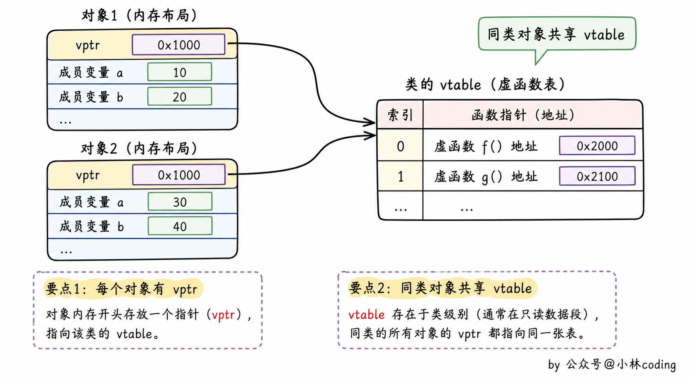
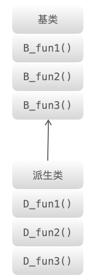
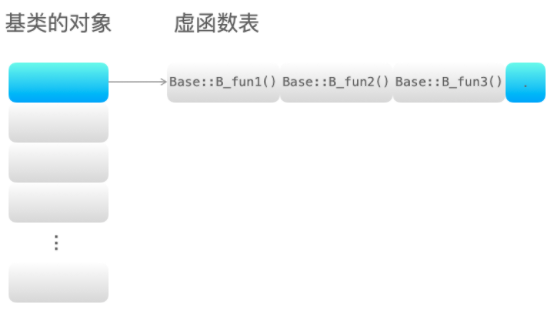
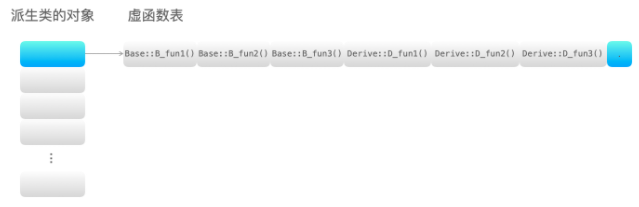
### 单继承和多继承的虚函数表结构是怎样的？

- 编译器将虚函数表的指针放在类的实例对象的内存空间中，该对象调用该类的虚函数时，通过指针找到虚函数表，再根据虚函数表中存放的虚函数的地址找到对应的虚函数。
- 如果派生类没有重新定义基类的虚函数 A，则派生类的虚函数表中保存的是基类的虚函数 A 的地址，也就是说基类和派生类的虚函数 A 的地址是一样的。
- 如果派生类重写了基类的某个虚函数 B，则派生类的虚函数表中保存的是重写后的虚函数 B 的地址，也就是说虚函数 B 有两个版本，分别存放在基类和派生类的虚函数表中。
- 如果派生类重新定义了新的虚函数 C，派生类的虚函数表保存新的虚函数 C 的地址。
- 下面是单继承且无虚函数覆盖的情况，派生类只是新增了自己的虚函数，基类的虚函数地址被原样继承下来。

```
#include <iostream>
using namespace std;

class Base
{
public:
    virtual void B_fun1() { cout << "Base::B_fun1()" << endl; }
    virtual void B_fun2() { cout << "Base::B_fun2()" << endl; }
    virtual void B_fun3() { cout << "Base::B_fun3()" << endl; }
};

class Derive : public Base
{
public:
    virtual void D_fun1() { cout << "Derive::D_fun1()" << endl; }
    virtual void D_fun2() { cout << "Derive::D_fun2()" << endl; }
    virtual void D_fun3() { cout << "Derive::D_fun3()" << endl; }
};
int main()
{
    Base *p = new Derive();
    p->B_fun1(); // Base::B_fun1()
    return 0;
}
```

- 下面是单继承且有虚函数覆盖的情况，派生类重写了基类的 fun1，此时派生类虚函数表中对应位置被替换为 Derive::fun1 的地址。

```
#include <iostream>
using namespace std;

class Base
{
public:
    virtual void fun1() { cout << "Base::fun1()" << endl; }
    virtual void B_fun2() { cout << "Base::B_fun2()" << endl; }
    virtual void B_fun3() { cout << "Base::B_fun3()" << endl; }
};

class Derive : public Base
{
public:
    virtual void fun1() { cout << "Derive::fun1()" << endl; }
    virtual void D_fun2() { cout << "Derive::D_fun2()" << endl; }
    virtual void D_fun3() { cout << "Derive::D_fun3()" << endl; }
};
int main()
{
    Base *p = new Derive();
    p->fun1(); // Derive::fun1()
    return 0;
}
```

- 下面是多继承且无虚函数覆盖的情况，派生类会为每个基类各维护一张虚函数表，基类的顺序和声明的顺序一致。

```
#include <iostream>
using namespace std;

class Base1
{
public:
    virtual void B1_fun1() { cout << "Base1::B1_fun1()" << endl; }
    virtual void B1_fun2() { cout << "Base1::B1_fun2()" << endl; }
    virtual void B1_fun3() { cout << "Base1::B1_fun3()" << endl; }
};
class Base2
{
public:
    virtual void B2_fun1() { cout << "Base2::B2_fun1()" << endl; }
    virtual void B2_fun2() { cout << "Base2::B2_fun2()" << endl; }
    virtual void B2_fun3() { cout << "Base2::B2_fun3()" << endl; }
};
class Base3
{
public:
    virtual void B3_fun1() { cout << "Base3::B3_fun1()" << endl; }
    virtual void B3_fun2() { cout << "Base3::B3_fun2()" << endl; }
    virtual void B3_fun3() { cout << "Base3::B3_fun3()" << endl; }
};

class Derive : public Base1, public Base2, public Base3
{
public:
    virtual void D_fun1() { cout << "Derive::D_fun1()" << endl; }
    virtual void D_fun2() { cout << "Derive::D_fun2()" << endl; }
    virtual void D_fun3() { cout << "Derive::D_fun3()" << endl; }
};

int main(){
    Base1 *p = new Derive();
    p->B1_fun1(); // Base1::B1_fun1()
    return 0;
}
```

- 下面是多继承且有虚函数覆盖的情况，派生类重写的 fun1 会同时覆盖三张基类虚函数表中各自的 fun1 表项，因此用三个基类指针调用的结果都相同。

```
#include <iostream>
using namespace std;

class Base1
{
public:
    virtual void fun1() { cout << "Base1::fun1()" << endl; }
    virtual void B1_fun2() { cout << "Base1::B1_fun2()" << endl; }
    virtual void B1_fun3() { cout << "Base1::B1_fun3()" << endl; }
};
class Base2
{
public:
    virtual void fun1() { cout << "Base2::fun1()" << endl; }
    virtual void B2_fun2() { cout << "Base2::B2_fun2()" << endl; }
    virtual void B2_fun3() { cout << "Base2::B2_fun3()" << endl; }
};
class Base3
{
public:
    virtual void fun1() { cout << "Base3::fun1()" << endl; }
    virtual void B3_fun2() { cout << "Base3::B3_fun2()" << endl; }
    virtual void B3_fun3() { cout << "Base3::B3_fun3()" << endl; }
};

class Derive : public Base1, public Base2, public Base3
{
public:
    virtual void fun1() { cout << "Derive::fun1()" << endl; }
    virtual void D_fun2() { cout << "Derive::D_fun2()" << endl; }
    virtual void D_fun3() { cout << "Derive::D_fun3()" << endl; }
};

int main(){
    Base1 *p1 = new Derive();
    Base2 *p2 = new Derive();
    Base3 *p3 = new Derive();
    p1->fun1(); // Derive::fun1()
    p2->fun1(); // Derive::fun1()
    p3->fun1(); // Derive::fun1()
    return 0;
}
```

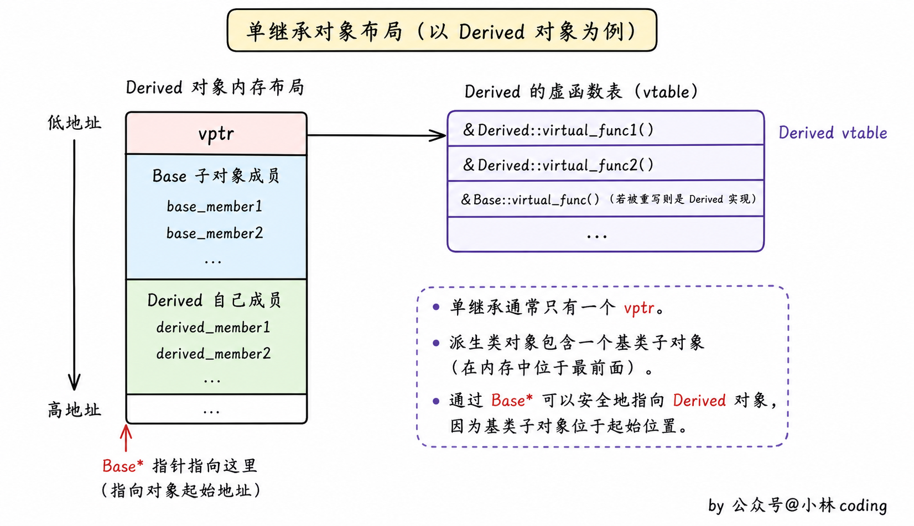
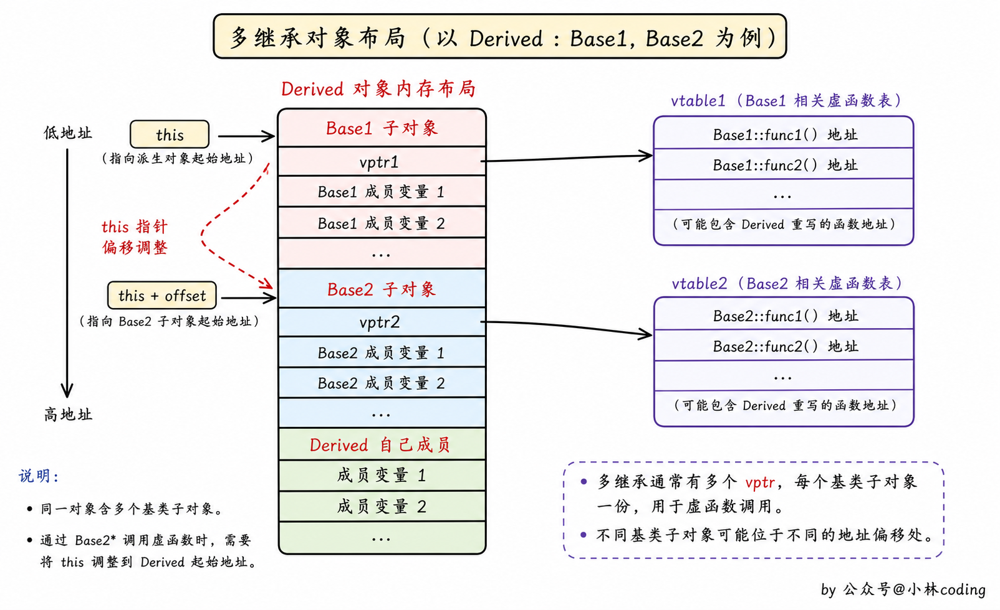
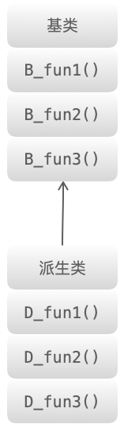
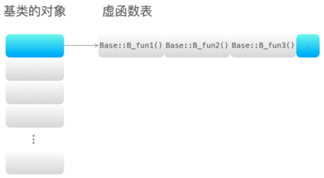
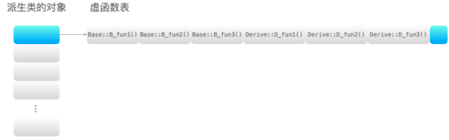
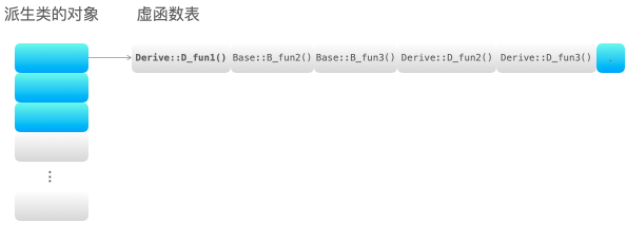
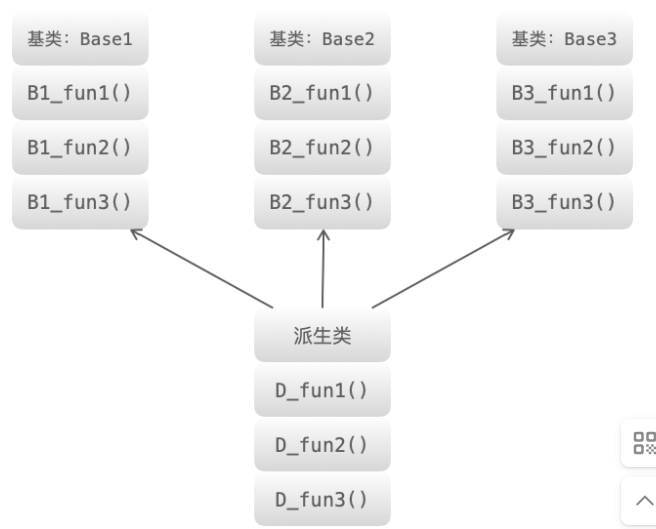
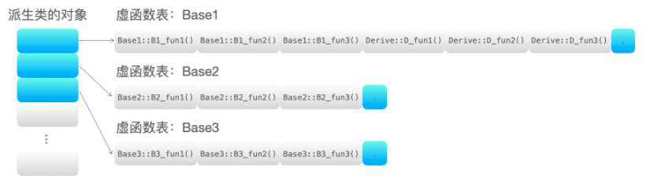
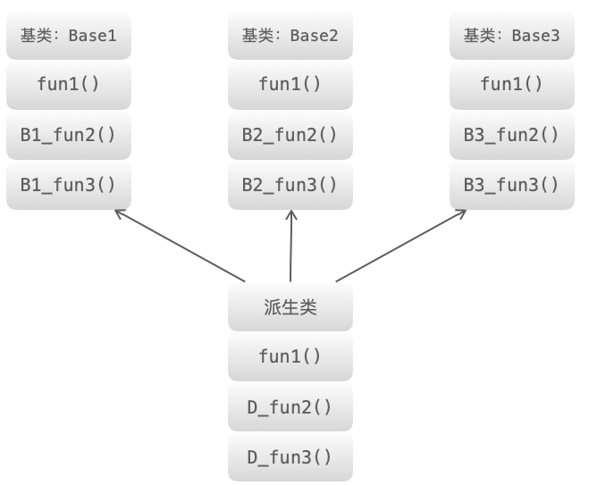
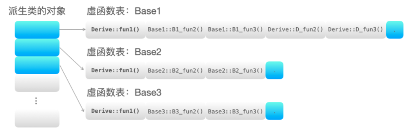
### C++空类的大小是多少？

- C++ 中空类的大小是 1 字节。
- 原因在于 C++ 规定任何对象都必须有一个唯一的内存地址，如果空类大小为 0，那么当创建这个类的多个对象时，它们会共享同一个地址，这违反了「每个对象地址唯一」的规则。
- 所以编译器会给空类隐式分配 1 字节的空间，目的就是为了让这个类的每个实例都能拥有独一无二的内存地址。

```
class A {};
int main(){
  cout<<sizeof(A)<<endl;// 输出 1;
  A a; 
  cout<<sizeof(a)<<endl;// 输出 1;
  return 0;
}
```

- C++ 空类的大小不为 0，不同编译器的具体值可能不一样，MSVC（VS）和 g++ 都将其设置为 1 字节。
- C++ 标准指出，不允许一个对象（当然包括类对象）的大小为 0，不同的对象不能具有相同的地址。
- 带有虚函数的 C++ 类大小不为 1，因为每一个对象会有一个 vptr 指向虚函数表，具体大小根据指针大小确定。
- C++ 中要求对于类的每个实例都必须有独一无二的地址，那么编译器自动为空类分配一个字节大小，这样便保证了每个实例均有独一无二的内存地址。
- 在 C++ 中空类会占一个字节，这是为了让对象的实例能够相互区别，具体来说，空类同样可以被实例化，并且每个实例在内存中都有独一无二的地址，因此编译器会给空类隐含加上一个字节。
- 当该空白类作为基类时，该类的大小就优化为 0 了，子类的大小就是子类本身的大小，这就是所谓的空白基类最优化。
- 空类的实例大小就是类的大小，所以 `sizeof(a)` 等于 1 字节；如果 a 是指针，则 `sizeof(a)` 就是指针本身的大小（32 位为 4 字节，64 位为 8 字节）。

### 只含虚函数的类的大小是多大？

- 因为含有虚函数的类对象里都会被编译器隐式插入一个虚函数表指针，教学上常记为 `__vptr`，但它不是 C++ 标准规定的名字，只是主流编译器的内部实现约定。
- 虚函数表指针的大小等于平台上的指针大小，在 32 位机器上是 4 字节，在 64 位机器上是 8 字节。

```
class A { virtual Fun(){} };
int main(){
  cout<<sizeof(A)<<endl;// 输出 4(32位机器)/8(64位机器);
  A a; 
  cout<<sizeof(a)<<endl;// 输出 4(32位机器)/8(64位机器);
  return 0;
}
```

### 一个只包含int 变量的空class和只包含int变量的空struct的内存各占多大？

- 只含有一个 int 成员变量的类的大小是 4 字节，也就是一个 int 变量的大小。

```
class A { int a; };
int main(){
  cout<<sizeof(A)<<endl;// 输出 4;
  A a; 
  cout<<sizeof(a)<<endl;// 输出 4;
  return 0;
}
```

- 只含有一个静态成员变量的类的大小是 1 字节，静态成员存放在静态存储区，不占用类的大小，普通函数也不占用类大小。

```
class A { static int a; };
int main(){
  cout<<sizeof(A)<<endl;// 输出 1;
  A a; 
  cout<<sizeof(a)<<endl;// 输出 1;
  return 0;
}
```

- 含有一个静态成员变量和一个普通 int 成员变量的类的大小是 4 字节，静态成员 a 不占用类的大小，所以类的大小就是 b 变量的大小，即 4 个字节。

```
class A { static int a; int b; };;
int main(){
  cout<<sizeof(A)<<endl;// 输出 4;
  A a; 
  cout<<sizeof(a)<<endl;// 输出 4;
  return 0;
}
```

## 速记要点

- 类未显式定义时，编译器会自动生成构造函数、析构函数、拷贝构造函数和赋值运算符重载这四个缺省函数。
- 纯虚函数的写法是在虚函数声明后加 `= 0`，含有纯虚函数的类就是抽象类，不能创建对象但可以声明其指针和引用。
- 派生类必须把基类所有纯虚函数全部实现后，才能实例化自己的对象。
- 虚函数表在编译阶段建立，虚函数表和类绑定，虚表指针和对象绑定，虚表指针存放在对象内存空间的最前面。
- 派生类重写虚函数后，其虚函数表中对应表项被替换成重写版本的地址。
- 多继承时派生类为每个基类各维护一张虚函数表，基类顺序与声明顺序一致。
- 空类大小为 1 字节，这样每个实例才能有独一无二的内存地址。
- 只含虚函数的类大小为指针大小，32 位是 4 字节，64 位是 8 字节。
- 静态成员变量和普通成员函数都不占用类的大小，静态成员存放在静态存储区。
