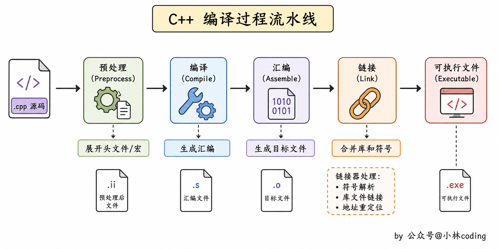
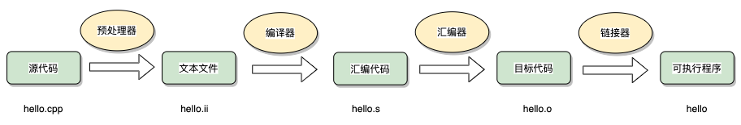
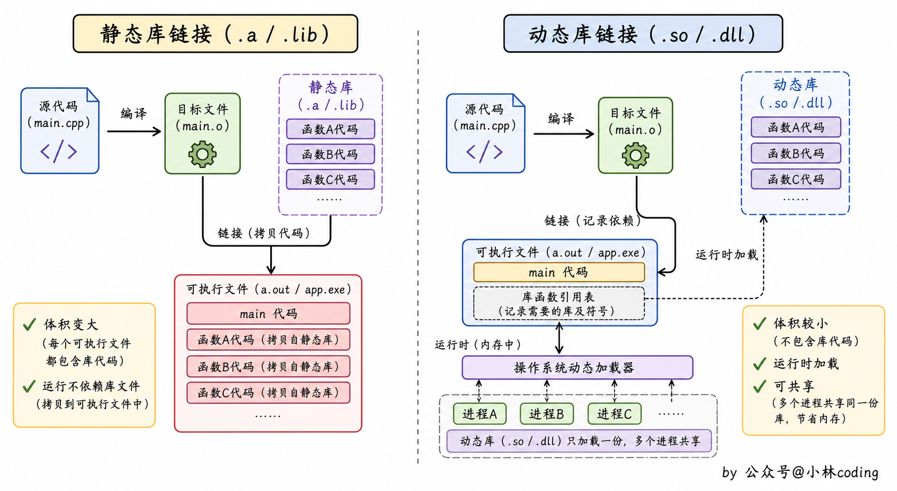

> 本笔记整理自小林coding《C++面试题》（https://xiaolincoding.com/interview/cpp.html），用于个人复习与分享，如涉侵权请联系删除。

# C++编译 笔记

编译与链接是 C++ 面试的高频基础题，几乎每场技术面都会从「一段代码怎么变成可执行程序」问起，并能顺势引出静态库、动态库、符号解析等更深的问题。

### C++的编译过程介绍一下？

- C++ 的编译过程一共经过预处理、编译、汇编和链接四个主要阶段。
- 预处理阶段会对源代码进行处理，主要包括展开宏定义、处理条件编译指令（如 #include、#define、#ifdef 等）以及删除注释等。
- 预处理的结果是生成一个经过宏展开和条件处理后的纯 C++ 源代码文件。
- 编译（Compilation）阶段将预处理后的源代码翻译为汇编语言，生成汇编代码。
- 在编译阶段，编译器会进行词法分析、语法分析和语义分析，检查代码的正确性，并生成中间代码表示。
- 汇编阶段将汇编代码转换为机器可以执行的目标文件，汇编器会把汇编代码转化为机器指令，并生成与机器硬件平台相关的目标文件（通常以 ".obj" 或 ".o" 为扩展名）。
- 链接阶段将目标文件与其他必要的库文件链接在一起，生成可执行程序，链接器会解析目标文件中的符号引用，将其与其他目标文件或库文件中的符号定义进行匹配，最终生成一个完整的可执行文件。
- 在链接阶段，还会进行地址重定位、符号解析、符号表生成等操作，确保程序的正确执行。

### 静态链接库和动态链接库有什么区别？

- **链接方式**：静态链接库在编译链接时会被完整地复制到可执行文件中，成为可执行文件的一部分；而动态链接库在编译链接时只会在可执行文件中包含对库的引用，实际的库文件在运行时由操作系统动态加载。
- **文件大小**：静态链接库会使得可执行文件的大小增加，因为库的代码被完整地复制到可执行文件中；而动态链接库不会增加可执行文件的大小，因为库的代码在运行时才会被加载。
- **内存占用**：静态链接库在运行时会被完整地加载到内存中，占用固定的内存空间；而动态链接库在运行时才会被加载，可以在多个进程之间共享，减少内存占用。
- **可扩展性**：动态链接库的可扩展性更好，可以在不修改可执行文件的情况下替换或添加新的库文件；而静态链接库需要重新编译链接。

## 速记要点

- C++ 编译的完整流程是预处理、编译、汇编、链接四步，面试时按这个顺序答最清晰。
- 预处理负责宏展开、头文件包含、条件编译和删除注释，产出的是纯 C++ 源码。
- 编译阶段做词法分析、语法分析和语义分析，把源码翻译成汇编代码。
- 汇编阶段把汇编代码变成机器指令，生成 .o 或 .obj 目标文件。
- 链接阶段做符号解析与地址重定位，把目标文件和库拼成一个可执行文件。
- 静态库在链接期被整体复制进可执行文件，动态库只在运行时被加载。
- 静态库会让可执行文件变大，动态库不会增加可执行文件的大小。
- 动态库可以被多个进程共享，内存占用更省，库更新时也无需重新编译主程序。

