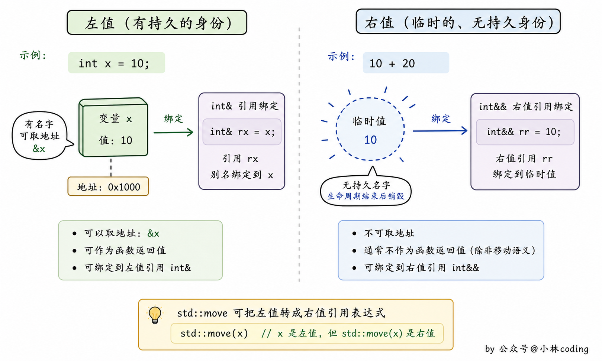
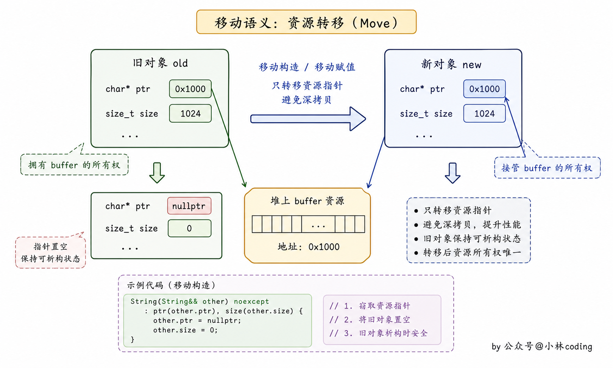
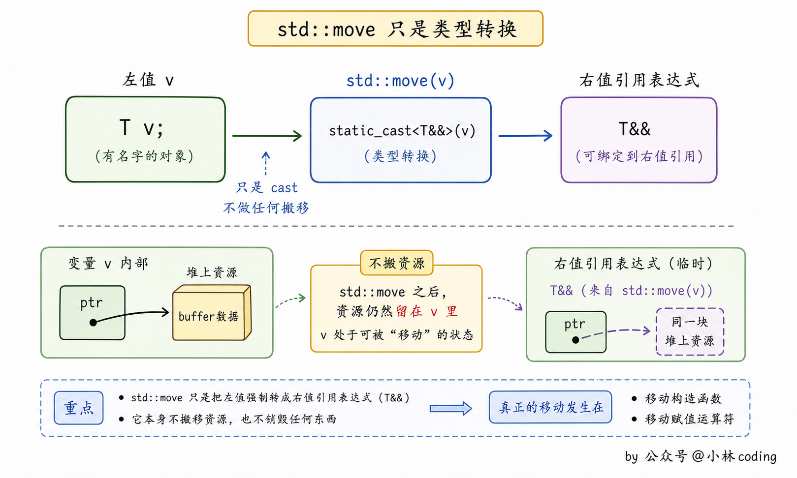
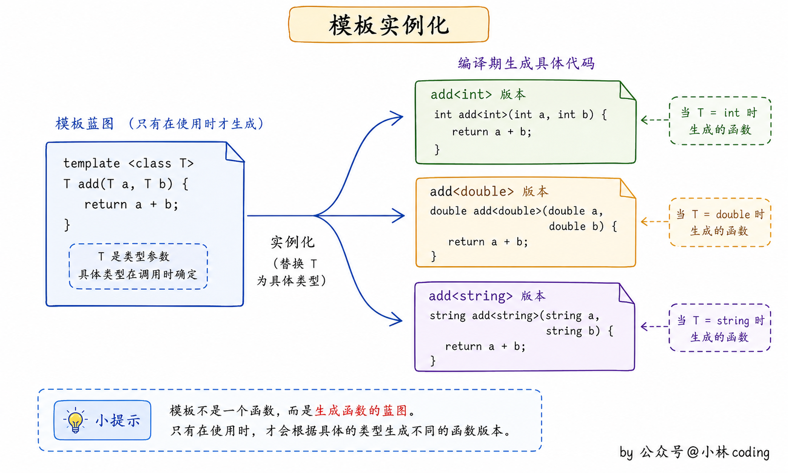

> 本笔记整理自小林coding《C++面试题》（https://xiaolincoding.com/interview/cpp.html），用于个人复习与分享，如涉侵权请联系删除。

# C++ 语言特性笔记

本类聚焦左值右值与右值引用、移动语义、std::move 实现原理，以及函数模板与类模板的实现和差异，是 C++11 之后最常被追问的一组考点。

### 左值和右值的区别？左值引用和右值引用的区别，如何将左值转换成右值？

- **左值**：指表达式结束后依然存在的持久对象。
- **右值**：指表达式结束就不再存在的临时对象。
- **核心区别**：左值持久，右值短暂。
- **左值引用**：用 `&` 声明，不能绑定到要转换的表达式、字面常量或返回右值的表达式。
- **右值引用**：用 `&&` 声明，恰好相反，可以绑定到这类表达式，但不能绑定到一个左值上。
- **右值引用可以自由移动资源**：右值引用只能绑定到一个将要销毁的对象上，因此可以自由地移动其资源。
- **左值转换成右值**：`std::move` 可以将一个左值强制转化为右值，继而可以通过右值引用使用该值，以用于移动语义。

```
#include <iostream>
using namespace std;

void fun1(int& tmp) 
{ 
  cout << "fun1(int& tmp):" << tmp << endl; 
} 

void fun2(int&& tmp) 
{ 
  cout << "fun2(int&& tmp)" << tmp << endl; 
} 

int main() 
{ 
  int var = 11; 
  fun1(12); // error: cannot bind non-const lvalue reference of type 'int&' to an rvalue of type 'int'
  fun1(var);
  fun2(1); 
}

```


### 介绍移动语义

- **要解决的问题**：传统的拷贝操作对于大型对象或资源密集型对象来说可能会有很高的开销，因为它们需要将对象的所有数据复制到新的对象中。
- **基本思路**：移动语义通过右值引用（Rvalue References）和移动构造函数（Move Constructors）来优化对象在内存中的传递和处理，避免不必要的数据复制，实现了对象资源的「移动」而非「复制」。
- **右值引用（Rvalue References）**：通过使用双引号 `&&` 声明右值引用，可以绑定到临时对象或右值，即那些将会被销毁的临时对象，右值引用允许我们对其资源进行移动操作而不是复制操作。

```
T&& t = T(); // t为右值引用

```

- **移动构造函数（Move Constructor）**：移动构造函数是专门用于将对象资源从一个右值引用对象「移动」到另一个对象的构造函数。
- **移动构造函数的做法**：它通过将资源所有权从一个对象转移到另一个对象来避免不必要的数据复制，从而提高程序性能。

```
// 移动构造函数示例
T(T&& other) {
    // 将other对象的资源移动到当前对象
}

```

- **标记对象为右值（std::move）**：使用 `std::move` 函数可以将一个对象标记为右值，以便可以调用移动构造函数而不是拷贝构造函数。

```
T obj1;
T obj2 = std::move(obj1); // 将obj1标记为右值，调用移动构造函数

```

- **应用价值**：移动语义的应用可以在涉及对象所有权转移的情况下提高性能，特别是在动态内存管理和容器元素移动时。
- **总体收益**：通过避免不必要的复制操作，移动语义使得代码更加高效和可维护，同时减少了资源的浪费。


### 右值引用有什么作用？

- **基本定义**：右值引用是 C++11 引入的特性，它是指对右值进行引用的一种方式。
- **作用一（实现移动语义）**：可以通过右值引用来实现移动语义，移动语义可以在不进行深拷贝的情况下，将对象的资源所有权从一个对象转移到另一个对象，从而提高代码的效率。
- **作用二（实现完美转发）**：右值引用还可以用于完美转发，在函数模板中，通过使用右值引用类型的形参来接收参数，可以实现完美转发。
- **完美转发的含义**：完美转发即保持原参数的值类别（左值还是右值），将参数传递给另一个函数。

### std::move() 函数的实现原理是什么？

- **函数原型**：`std::move()` 的形参是 `T&&`，返回类型是 `typename remove_reference<T>::type&&`，函数体内只做一次 `static_cast` 强制类型转换。

```
template <typename T>
typename remove_reference<T>::type&& move(T&& t) {
    return static_cast<typename remove_reference<T>::type &&>(t);
}

```

- **引用折叠原理**：右值传递给上述函数的形参 `T&&` 依然是右值，即 `T&& &&` 相当于 `T&&`。
- **引用折叠原理（左值）**：左值传递给上述函数的形参 `T&&` 依然是左值，即 `T&& &` 相当于 `T&`。
- **小结**：通过引用折叠原理可以知道，`move()` 函数的形参既可以是左值也可以是右值。
- **remove_reference 通用版本**：最通用的版本里 `typedef T type;`，即定义 T 的类型别名为 type。
- **remove_reference 左值引用特例**：`remove_reference<T&>` 是左值引用的部分特例化版本，同样把 `type` 定义为 `T`。
- **remove_reference 右值引用特例**：`remove_reference<T&&>` 是右值引用的部分特例化版本，同样把 `type` 定义为 `T`。
- **特例化的效果**：举例来说，`int i;` 之后 `remove_reference<decltype(42)>::type a;` 使用原版本，`remove_reference<decltype(i)>::type b;` 使用左值引用特例版本，`remove_reference<decltype(std::move(i))>::type b;` 使用右值引用特例版本，定义的 a、b、c 三个变量都是 int 类型。

```
//原始的，最通用的版本
template <typename T>
struct remove_reference {
    typedef T type;  //定义 T 的类型别名为 type
};

//部分版本特例化，将用于左值引用和右值引用
template <class T>
struct remove_reference<T&> { //左值引用
    typedef T type;
};

template <class T>
struct remove_reference<T&&> { //右值引用
    typedef T type;
};

//举例如下,下列定义的a、b、c三个变量都是int类型
int i;
remove_reference<decltype(42)>::type a;             //使用原版本，
remove_reference<decltype(i)>::type  b;             //左值引用特例版本
remove_reference<decltype(std::move(i))>::type  b;  //右值引用特例版本

```

- **第一步（推导与折叠）**：`std::move(var)` 推导为 `std::move(int&& &)`，折叠后为 `std::move(int&)`。
- **第二步（去引用）**：此时 T 的类型为 `int&`，`typename remove_reference<T>::type` 为 `int`，这里使用的是 `remove_reference` 的左值引用的特例化版本。
- **第三步（强转）**：通过 `static_cast` 将 `int&` 强制转换为 `int&&`，整个 `std::move` 被实例化为 `int&& move(int& t) { return static_cast<int&&>(t); }`。

```
int var = 10;

转化过程：
1. std::move(var) => std::move(int&& &) => 折叠后 std::move(int&)
2. 此时：T 的类型为 int&，typename remove_reference<T>::type 为 int，这里使用 remove_reference 的左值引用的特例化版本
3. 通过 static_cast 将 int& 强制转换为 int&&

整个std::move被实例化如下：
int&& move(int& t) {
    return static_cast<int&&>(t);
}

```

- **整体实现原理**：利用引用折叠原理将右值经过 `T&&` 传递类型保持不变还是右值，而左值经过 `T&&` 变为普通的左值引用，以保证模板可以传递任意实参且保持类型不变。
- **收尾两步**：然后通过 `remove_reference` 移除引用得到具体的类型 T，最后通过 `static_cast<>` 进行强制类型转换，返回 `T&&` 右值引用。


### 如何判断结构体是否相等？能否用 memcmp 函数判断结构体相等？

- **结论**：需要重载操作符 `==` 判断两个结构体是否相等，不能用函数 `memcmp` 来判断两个结构体是否相等。
- **原因**：`memcmp` 函数是逐个字节进行比较的，而结构体存在内存空间中保存时存在字节对齐。
- **对齐带来的问题**：字节对齐时补的字节内容是随机的，会产生垃圾值，所以无法比较。
- **实现方式**：在结构体中用 `friend bool operator==(const A &tmp1, const A &tmp2);` 声明友元运算符重载函数，再在结构体外逐个比较成员变量。

```
#include <iostream>

using namespace std;

struct A
{
    char c;
    int val;
    A(char c_tmp, int tmp) : c(c_tmp), val(tmp) {}

    friend bool operator==(const A &tmp1, const A &tmp2); //  友元运算符重载函数
};

bool operator==(const A &tmp1, const A &tmp2)
{
    return (tmp1.c == tmp2.c && tmp1.val == tmp2.val);
}

int main()
{
    A ex1('a', 90), ex2('b', 80);
    if (ex1 == ex2)
        cout << "ex1 == ex2" << endl;
    else
        cout << "ex1 != ex2" << endl; // 输出
    return 0;
}

```


### 什么是模板？如何实现？

- **概念**：模板是创建类或者函数的蓝图或者公式，分为函数模板和类模板。
- **实现方式**：模板定义以关键字 `template` 开始，后跟一个模板参数列表。
- **约束一**：模板参数列表不能为空。
- **约束二**：模板类型参数前必须使用关键字 `class` 或者 `typename`，在模板参数列表中这两个关键字含义相同，可互换使用。

```
template <typename T, typename U, ...>

```

- **函数模板的价值**：通过定义一个函数模板，可以避免为每一种类型定义一个新函数。
- **函数模板的用法**：对于函数模板而言，模板类型参数可以用来指定返回类型或函数的参数类型，以及在函数体内用于变量声明或类型转换。
- **函数模板实例化**：当调用一个模板时，编译器用函数实参来推断模板实参，从而使用实参的类型来确定绑定到模板参数的类型。

```
#include <iostream>
using namespace std;

template <typename T>
T add_fun(const T & tmp1, const T & tmp2) {
    return tmp1 + tmp2;
}

int main() {
    int var1, var2;
    cin >> var1 >> var2;
    cout << add_fun(var1, var2);
    
    double var3, var4;
    cin >> var3 >> var4;
    cout << add_fun(var3, var4);
    return 0;
}

```

- **类模板的写法**：类似函数模板，类模板以关键字 `template` 开始，后跟模板参数列表。
- **类模板必须显式指定**：编译器不能为类模板推断模板参数类型，需要在使用该类模板时，在模板名后面的尖括号中指明类型。

```
#include <iostream>
using namespace std;

template <typename T>
class Complex {
public:
    //构造函数
    Complex(T a, T b) {
        this->a = a;
        this->b = b;
    }
    
    //运算符重载
    Complex<T> operator+(Complex &c) {
        Complex<T> tmp(this->a + c.a, this->b + c.b);
        cout << tmp.a << " " << tmp.b << endl;
        return tmp;
    }
private:
    T a;
    T b;
};

int main() {
    Complex<int> a(10, 20);
    Complex<int> b(20, 30);
    Complex<int> c = a + b;
    return 0;
}

```


### 函数模板和类模板的区别？

- **实例化方式**：函数模板实例化由编译程序在处理函数调用时自动完成，类模板实例化需要在程序中显式指定。
- **实例化的结果**：函数模板实例化后是一个函数，类模板实例化后是一个类。
- **默认参数**：类模板在模板参数列表中可以有默认参数。
- **特化**：函数模板只能全特化，而类模板可以全特化，也可以偏特化。
- **调用方式**：函数模板可以隐式调用，也可以显式调用，类模板只能显式调用。

```
#include <iostream>
using namespace std;

template <typename T>
T add_fun(const T & tmp1, const T & tmp2) {
    return tmp1 + tmp2;
}

int main() {
    int var1, var2;
    cin >> var1 >> var2;
    cout << add_fun<int>(var1, var2); // 显式调用
    
    double var3, var4;
    cin >> var3 >> var4;
    cout << add_fun(var3, var4); // 隐式调用
    return 0;
}

```

- **什么是可变参数模板**：可变参数模板是接受可变数目参数的模板函数或模板类，将可变数目的参数称为参数包，包括模板参数包和函数参数包。
- **模板参数包**：表示零个或多个模板参数。
- **函数参数包**：表示零个或多个函数参数。
- **省略号的用法**：用省略号来指出一个模板参数或函数参数表示一个包。
- **模板参数列表中的省略号**：在模板参数列表中，`class...` 或 `typename...` 指出接下来的参数表示零个或多个类型的列表。
- **类型名后的省略号**：一个类型名后面跟一个省略号表示零个或多个给定类型的非类型参数的列表。
- **sizeof... 运算符**：当需要知道包中有多少元素时，可以使用 `sizeof...` 运算符。
- **递归展开（终止版本）**：可变参数函数通常是递归的，第一个版本的 `print_fun` 负责终止递归并打印初始调用中的最后一个实参。
- **递归展开（可变参数版本）**：第二个版本的 `print_fun` 是可变参数版本，打印绑定到 t 的实参，并用来调用自身来打印函数参数包中的剩余值。

```
template <typename T, typename... Args> // Args 是模板参数包
void foo(const T &t, const Args&... rest); // 可变参数模板，rest 是函数参数包

#include <iostream>
using namespace std;

template <typename T>
void print_fun(const T &t) {
    cout << t << endl; // 最后一个元素
}

template <typename T, typename... Args>
void print_fun(const T &t, const Args &...args) {
    cout << t << " ";
    print_fun(args...);
}

int main() {
    print_fun("Hello", "wolrd", "!");
    return 0;
}
/*运行结果：
Hello wolrd !
*/

```


## 速记要点

1. 左值是表达式结束后依然存在的持久对象，右值是表达式结束就不再存在的临时对象，核心区别是「左值持久，右值短暂」。
2. 左值引用用 `&` 声明，不能绑定字面常量或返回右值的表达式，右值引用用 `&&` 声明，不能绑定左值，且因为它只能绑定到将要销毁的对象上，才可以自由移动其资源。
3. `std::move` 只做一次 `static_cast<T&&>` 的强制类型转换，运行期并不搬移任何数据，是否真的发生移动取决于目标类型有没有移动构造或移动赋值。
4. 引用折叠规则是 `T&& &&` 折叠为 `T&&`、`T&& &` 折叠为 `T&`，这让 `T&&` 形参既能接左值也能接右值，是移动语义与完美转发的共同基础。
5. 移动语义的两个落点是右值引用和移动构造函数，移动构造函数把资源所有权从一个对象转移到另一个对象，从而避免深拷贝的高开销。
6. 判断结构体相等要重载 `operator==`，不能用 `memcmp`，因为结构体存在字节对齐，对齐补出来的字节内容是随机的垃圾值。
7. 模板定义以 `template` 开始，模板参数列表不能为空，类型参数前必须使用 `class` 或 `typename`，两者含义相同可互换。
8. 函数模板实例化由编译器根据函数实参自动推断完成，类模板不能推断，必须在模板名后的尖括号中显式指明类型。
9. 类模板可以有默认参数且支持全特化与偏特化，函数模板只能全特化，调用上函数模板可隐式可显式、类模板只能显式。
10. 可变参数模板用省略号声明模板参数包与函数参数包，通常靠递归展开，用 `sizeof...` 可以取得包中元素个数。
