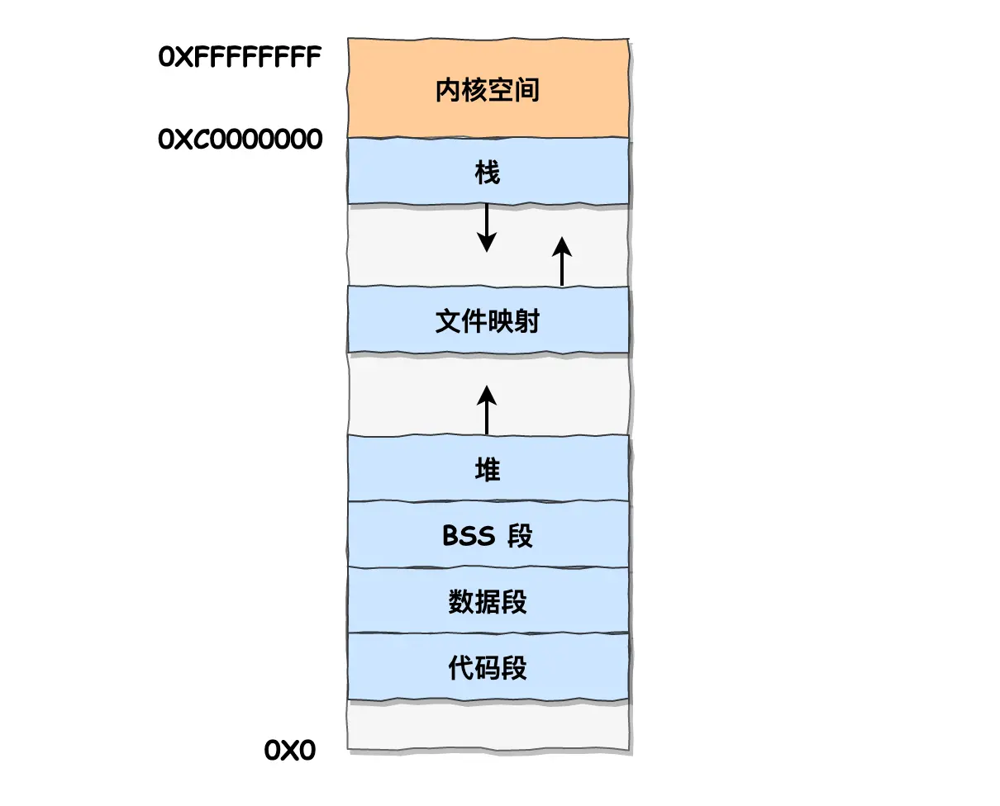
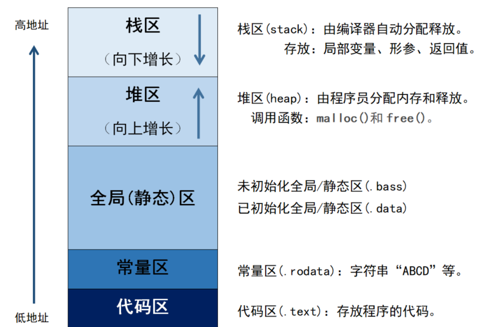
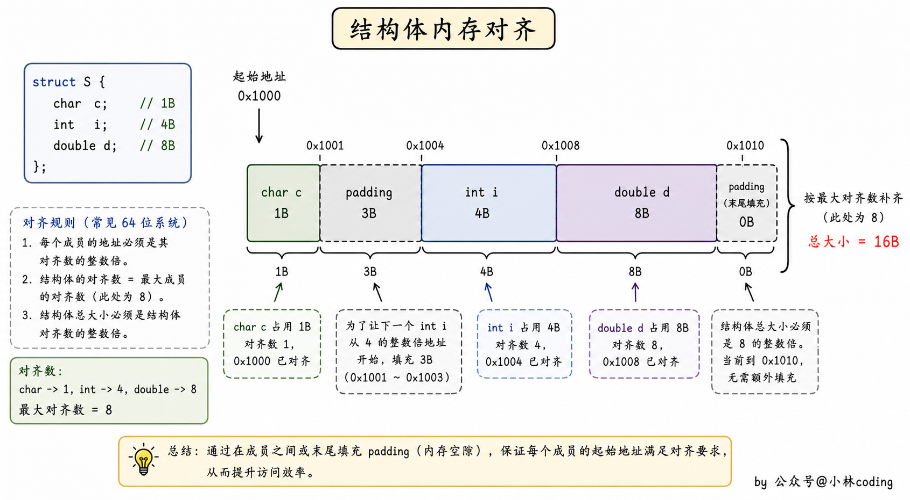
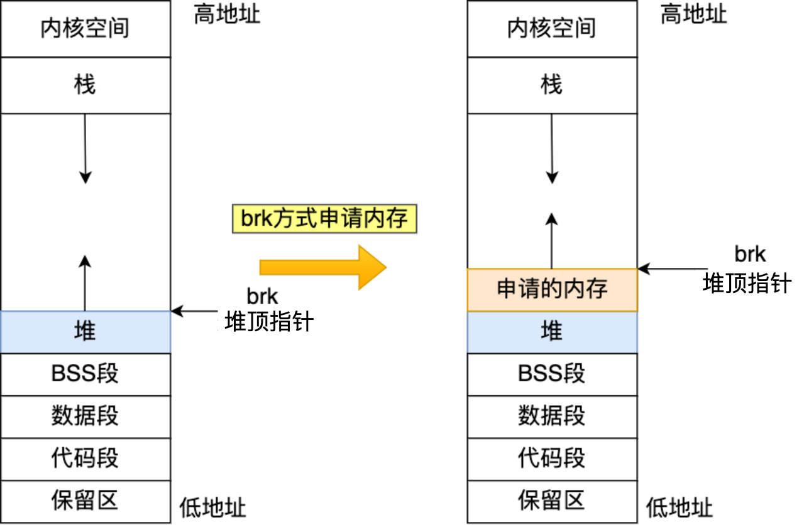
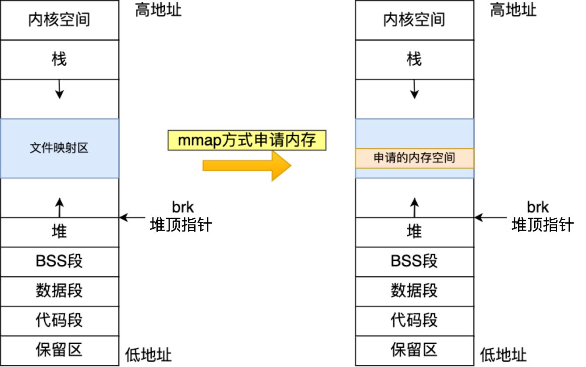
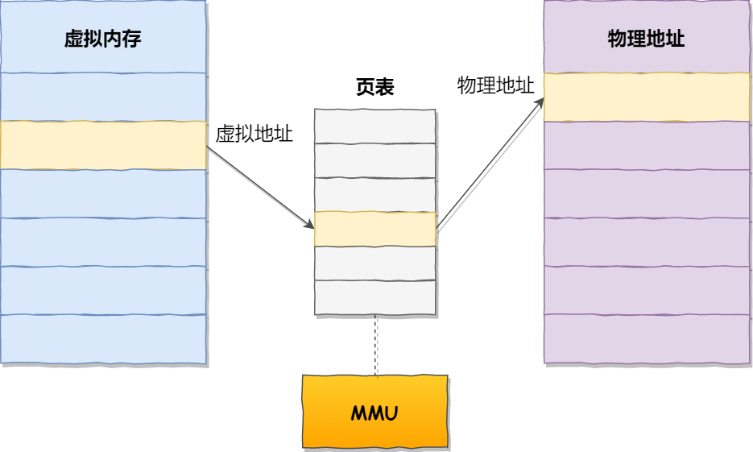
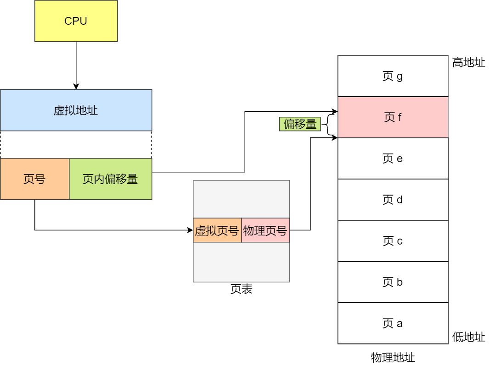
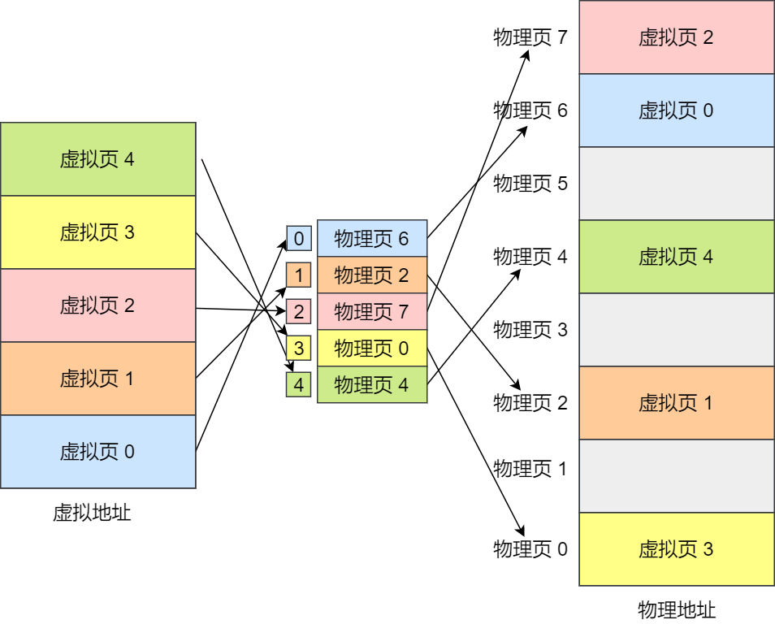

> 本笔记整理自小林coding《C++面试题》（https://xiaolincoding.com/interview/cpp.html），用于个人复习与分享，如涉侵权请联系删除。

# C++内存管理 笔记

本类覆盖虚拟内存、用户态地址空间的划分、C++ 内存分区、内存对齐、堆与栈的区别，以及 malloc 与 new 的底层实现和分页内存管理。这一组考点几乎每场 C++ 面试都会问到，重点考查是否真正理解内存是怎么分配和回收的。

### 虚拟内存介绍一下

- 虚拟内存的第一个作用是让进程对运行内存的使用超过物理内存大小，因为程序运行符合局部性原理，CPU 访问内存会有很明显的重复访问的倾向性，对于那些没有被经常使用到的内存，可以把它换出到物理内存之外，比如硬盘上的 swap 区域。
- 虚拟内存的第二个作用是为每个进程提供独立的地址空间，由于每个进程都有自己的页表，所以每个进程的虚拟内存空间就是相互独立的，进程也没有办法访问其他进程的页表，因为这些页表是私有的，这就解决了多进程之间地址冲突的问题。
- 虚拟内存的第三个作用是提升内存访问的安全性，页表里的页表项中除了物理地址之外，还有一些标记属性的比特，比如控制一个页的读写权限、标记该页是否存在等，在内存访问方面操作系统提供了更好的安全性。

### 虚拟内存用户态的地址空间怎么分配的

- 用户态地址空间是一块连续的虚拟地址范围，比如 32 位系统通常是 0~3GB，64 位系统范围更大，整体按从低到高的顺序分成几块，每块有专门用途，互不干扰。
- 代码段，包括二进制可执行代码。
- 数据段，包括已初始化的静态常量和全局变量。
- BSS 段，包括未初始化的静态变量和全局变量。
- 堆段，包括动态分配的内存，从低地址开始向上增长。
- 文件映射段，包括动态库、共享内存等。
- 栈段，包括局部变量和函数调用的上下文等，比如函数里定义的 `int x = 5` 就在栈里，栈的大小是固定的，一般是 8MB，当然系统也提供了参数，以便我们自定义大小。

### C++中的内存分区有哪些？

- 在 C++ 中，内存主要分为以下五个区域。
- 栈区（Stack）：由编译器自动分配释放，存放函数的参数值和局部变量等，其操作方式类似于数据结构中的栈。
- 堆区（Heap）：一般由程序员分配释放，若程序员不释放，程序结束时可能由 OS 回收，注意它与数据结构中的堆是两回事，分配方式倒是类似于链表。
- 全局区（静态区）（Static）：全局变量和静态变量被分配到同一块内存中，在 C++ 中全局区还包含了常量区，字符串常量和其他常量也是存储在此。
- 常量区：是全局区的一部分，存放常量，不允许修改。
- 代码区（Text）：存放函数体的二进制代码。

### 介绍一下内存对齐

- 内存对齐就是将数据存放在内存的某个位置，使得 CPU 可以更快地访问到这个数据，本质上是以空间换时间的方式来提高 CPU 访问数据的性能。
- 第一个概念是对齐边界，一般情况下编译器会自动地将数据存放在它的自然边界上，例如 int 类型的数据大小为 4 字节，编译器会将其存放在 4 的倍数的地址上，这就是所谓的对齐边界。
- 第二个概念是填充字节，为了满足对齐边界的要求，编译器有时候需要在数据之间填充一些字节，这些字节没有实际的意义，只是为了满足内存对齐的要求。

### 为什么要字节对齐？

- 平台原因（移植原因）：不是所有的硬件平台都能访问任意地址上的任意数据，某些硬件平台只能在某些地址处取某些特定类型的数据，否则会抛出硬件异常。
- 性能原因：数据结构尤其是栈应该尽可能地在自然边界上对齐，原因在于为了访问未对齐的内存，处理器需要作两次内存访问，而对齐的内存访问仅需要一次访问。

### 动态链接库怎么装载到内存的？

- 动态链接库是通过 mmap 把该库直接映射到各个进程的地址空间中来完成装载的。
- 尽管每个进程都认为自己地址空间中加载了该库，但实际上该库在内存中只有一份，mmap 就这样很神奇地和动态链接库联动起来了。

### 函数调用的时候压栈怎么样的

- 第一步是保存返回地址，在函数调用前，调用指令会将下一条指令的地址，即函数调用后需要继续执行的地址压入栈中，以便函数执行完毕后能够正确返回到调用点。
- 第二步是保存调用者的栈帧指针，在函数调用前，调用指令会将当前栈帧指针，即调用者的栈指针压入栈中，以便函数执行完毕后能够恢复到调用者的执行状态。
- 第三步是传递参数，函数调用时会将参数值依次压入栈中，这些参数值在函数内部可以通过栈来访问。
- 第四步是分配局部变量空间，函数调用时会为局部变量分配空间，这些局部变量会被保存在栈中，栈指针会相应地移动以适应新的局部变量空间。

### C++中堆和栈的区别

- 申请方式不同。
  - 栈由系统自动分配，例如声明在函数中的一个局部变量 `int b`，系统自动在栈中为 b 开辟空间。
  - 堆需要程序员自己申请并指明大小，在 C 语言中通过 malloc 函数申请，写法是 `p1 = (char *)malloc(10);`，在 C++ 中用 new 运算符申请，写法是 `p2 = new char[20];`。
- 申请后系统的响应不同。
  - 栈：只要栈的剩余空间大于所申请空间，系统就会为程序提供内存，否则将报异常提示栈溢出。
  - 堆：操作系统有一个记录空闲内存地址的链表，当系统收到程序的申请时会遍历该链表，寻找第一个空间大于所申请空间的堆结点，然后将该结点从空闲结点链表中删除，并将该结点的空间分配给程序。
  - 堆内存块的首地址处会记录本次分配的大小，这样代码中的 delete 语句才能正确地释放本内存空间，另外由于找到的堆结点的大小不一定正好等于申请的大小，系统会自动地将多余的那部分重新放入空闲链表中。
- 申请大小的限制不同。
  - 栈是向低地址扩展的数据结构，是一块连续的内存区域，栈顶的地址和栈的最大容量是系统预先规定好的，栈的大小通常只有几 MB，如果申请的空间超过栈的剩余空间时将提示 overflow，因此能从栈获得的空间较小。
  - 堆是向高地址扩展的数据结构，是不连续的内存区域，这是由于系统是用链表来存储空闲内存地址的，自然是不连续的，而链表的遍历方向是由低地址向高地址，堆的大小受限于计算机系统中有效的虚拟内存，由此可见堆获得的空间比较灵活，也比较大。
- 生命周期不同。
  - 栈的内存管理是自动的，变量的内存会在其作用域结束时自动释放。
  - 堆的内存管理需要手动进行，需要使用 new 关键字分配内存，并使用 delete 或 delete[] 关键字释放内存，否则会导致内存泄漏。

### new是在内存上哪一块去分配的内存？

- new 所申请的内存区域在 C++ 中称为自由存储区。
- 很多编译器的 new/delete 都是以 malloc/free 为基础来实现的，所以通常都是借由堆来实现自由存储，这时候就可以说 new 所申请的内存区域在堆上。

### 如果new内存失败了会是怎么样？

- new 申请内存失败会抛出 std::bad_alloc 异常。
- 如果加上 std::nothrow 关键字，写成 `A* p = new (std::nothrow) A;`，那么 new 就不会抛出异常，而是会返回空指针。

### C++ malloc和new的区别是什么？

- 分配内存的位置不同，malloc 是从堆上动态分配内存，new 是从自由存储区为对象动态分配内存。
- 自由存储区的位置取决于 operator new 的实现，自由存储区不仅可以为堆，还可以是静态存储区，这都看 operator new 在哪里为对象分配内存。
- 返回类型安全性不同，malloc 内存分配成功后返回 void*，需要再强制类型转换为需要的类型，new 操作符分配内存成功后返回与对象类型相匹配的指针类型，因此 new 是符合类型安全的操作符。
- 内存分配失败时的表现不同，malloc 内存分配失败后返回 NULL，new 分配内存失败则会抛出 bad_alloc 异常。
- 分配内存的大小的计算方式不同，使用 new 操作符申请内存分配时无须指定内存块的大小，编译器会根据类型信息自行计算，而 malloc 则需要显式地指出所需内存的尺寸。
- 是否可以被重载不同，operator new / operator delete 可以被重载，而 malloc/free 则不能重载。

### new 和 malloc 如何判断是否申请到内存？

- malloc：成功申请到内存时返回指向该内存的指针，分配失败时返回 NULL 指针。
- new：内存分配成功时返回该对象类型的指针，分配失败时抛出 bad_alloc 异常。

### delete和free的区别

- new/delete 是 C++ 的操作符，而 malloc/free 是 C 中的函数。
- new 做两件事，一是分配内存，二是调用类的构造函数，同样 delete 会调用类的析构函数和释放内存，而 malloc 和 free 只是分配和释放内存。
- new 建立的是一个对象，而 malloc 分配的是一块内存，new 建立的对象可以用成员函数访问，不要直接访问它的地址空间，malloc 分配的是一块内存区域，用指针访问，可以在里面移动指针。
- new 出来的指针是带有类型信息的，而 malloc 返回的是 void 指针。
- new/delete 是保留字，不需要头文件支持，malloc/free 需要头文件库函数支持。

### delete 实现原理？delete 和 delete[] 的区别？

- delete 的实现原理是首先执行该对象所属类的析构函数，进而通过调用 operator delete 的标准库函数来释放所占的内存空间。
- delete 用来释放单个对象所占的空间，只会调用一次析构函数。
- delete[] 用来释放数组空间，会对数组中的每个成员都调用一次析构函数。

### malloc 的原理？malloc 的底层实现？

- malloc 的原理是当开辟的空间小于 128K 时调用 brk() 函数，通过移动 _enddata 来实现，当开辟空间大于 128K 时调用 mmap() 函数，通过在虚拟地址空间中开辟一块内存空间来实现。
- brk() 函数的实现原理是向高地址的方向移动指向数据段的高地址的指针 _enddata。
- mmap 内存映射原理的第一步是进程启动映射过程，并在虚拟地址空间中为映射创建虚拟映射区域。
- mmap 内存映射原理的第二步是调用内核空间的系统调用函数 mmap()，实现文件物理地址和进程虚拟地址的一一映射关系。
- mmap 内存映射原理的第三步是进程发起对这片映射空间的访问，引发缺页异常，实现文件内容到物理内存（主存）的拷贝。

### malloc 1KB和1MB 有什么区别？

- malloc() 源码里默认定义了一个阈值，如果用户分配的内存小于 128 KB 则通过 brk() 申请内存，如果用户分配的内存大于 128 KB 则通过 mmap() 申请内存。
- 需要注意，不同的 glibc 版本定义的阈值也是不同的。

### 介绍一下malloc的brk，mmap

- 实际上，malloc() 并不是系统调用，而是 C 库里的函数，用于动态分配内存。
- malloc 申请内存的时候，会有两种方式向操作系统申请堆内存，方式一是通过 brk() 系统调用从堆分配内存，方式二是通过 mmap() 系统调用在文件映射区域分配内存。
- 方式一的实现方式很简单，就是通过 brk() 函数将「堆顶」指针向高地址移动，获得新的内存空间。
- 方式二通过 mmap() 系统调用中「私有匿名映射」的方式，在文件映射区分配一块内存，也就是从文件映射区“偷”了一块内存。

### 分页内存管理说一下

- 分页是把整个虚拟和物理内存空间切成一段段固定尺寸的大小，这样一个连续并且尺寸固定的内存空间叫做页（Page），在 Linux 下每一页的大小为 4KB。
- 虚拟地址与物理地址之间通过页表来映射，页表是存储在内存里的，内存管理单元（MMU）就做将虚拟内存地址转换成物理地址的工作。
- 当进程访问的虚拟地址在页表中查不到时，系统会产生一个缺页异常，进入系统内核空间分配物理内存、更新进程页表，最后再返回用户空间，恢复进程的运行。
- 在分页机制下，虚拟地址分为两部分，分别是页号和页内偏移，页号作为页表的索引，页表包含物理页每页所在物理内存的基地址，这个基地址与页内偏移的组合就形成了物理内存地址。
- 总结一下，一次内存地址转换其实就是三个步骤，第一步是把虚拟内存地址切分成页号和偏移量，第二步是根据页号从页表里面查询对应的物理页号，第三步是直接拿物理页号加上前面的偏移量，就得到了物理内存地址。

## 速记要点

1. 虚拟内存的三大作用是让进程可用内存超过物理内存、让每个进程拥有独立私有的地址空间，以及通过页表项上的权限比特提升内存访问的安全性。
2. 用户态地址空间从低到高依次是代码段、数据段、BSS 段、堆段、文件映射段和栈段，其中堆从低地址向上增长，栈大小固定一般为 8MB。
3. C++ 内存分为栈区、堆区、全局区（静态区）、常量区和代码区五块，其中常量区属于全局区的一部分，存放不允许修改的常量。
4. 内存对齐是以空间换时间，靠「对齐边界」和「填充字节」两个概念实现，未对齐的内存访问需要两次内存访问，对齐的内存访问只需要一次。
5. 堆和栈的区别集中在申请方式、系统响应、大小限制和生命周期上，栈由系统自动分配、向低地址扩展且只有几 MB，堆由程序员手动分配、向高地址扩展且不连续。
6. new 申请的区域叫自由存储区，多数编译器用 malloc/free 实现 new/delete，所以通常可以说 new 申请的内存在堆上。
7. new 分配失败抛 std::bad_alloc 异常，加上 std::nothrow 后改为返回空指针，而 malloc 分配失败返回 NULL。
8. new/delete 是 C++ 操作符，除了分配和释放内存还会调用构造函数和析构函数，malloc/free 是 C 库函数，只负责分配和释放内存，且 operator new / operator delete 可以被重载而 malloc/free 不能。
9. delete 先调用析构函数再调用 operator delete 释放内存，delete 只调用一次析构函数，delete[] 会对数组中每个成员都调用一次析构函数。
10. malloc 以 128KB 为阈值，小于该阈值走 brk() 移动堆顶指针 _enddata，大于该阈值走 mmap() 私有匿名映射，该阈值随 glibc 版本而不同。
11. 分页机制把内存切成固定大小的页（Linux 下 4KB），地址转换分三步：切分出页号与偏移量、用页号查页表得到物理页号、物理页号加偏移量得到物理地址，查不到时触发缺页异常。

