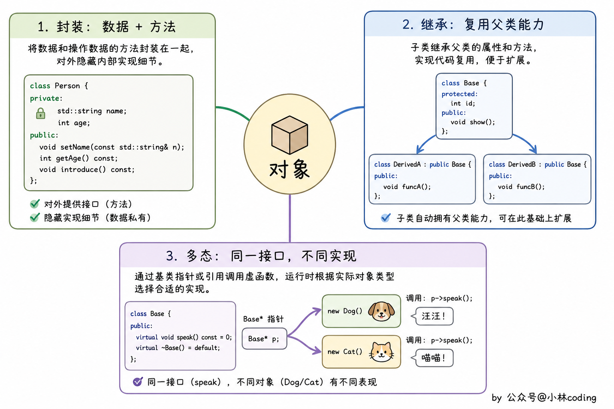
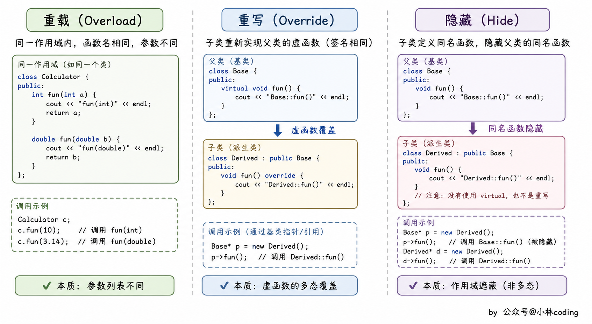
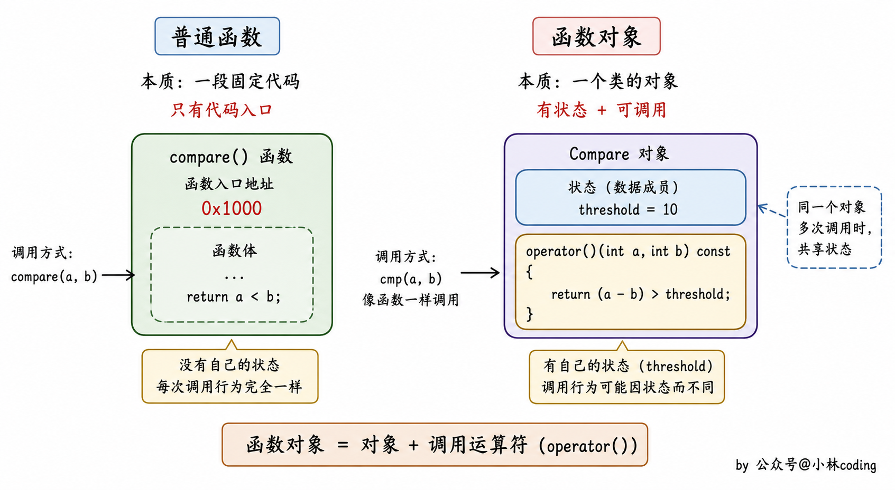

> 本笔记整理自小林coding《C++面试题》（https://xiaolincoding.com/interview/cpp.html），用于个人复习与分享，如涉侵权请联系删除。

# C++面向对象 笔记

封装、继承、多态是 C++ 面试必问的三块基石，而重载、重写、隐藏的辨析以及虚函数的实现机制，则是拉开差距的分水岭题。

### 什么是面向对象？面向对象的三大特性

- 面向对象中的对象是指具体的某一个事物，这些事物的抽象就是类，类中包含数据（成员变量）和动作（成员方法）。
- 封装是将具体的实现过程和数据封装成一个函数，只能通过接口进行访问，从而降低耦合性。
- 继承是指子类继承父类的特征和行为，子类拥有父类的非 private 方法或成员变量，子类还可以对父类的方法进行重写。
- 继承增强了类之间的耦合性，但当父类中的成员变量、成员函数或者类本身被 final 关键字修饰时，被修饰的类不能被继承，被修饰的成员不能被重写或修改。
- 多态就是不同继承类的对象对同一消息做出不同的响应，基类的指针指向或绑定到派生类的对象，使得基类指针呈现不同的表现方式。


### C++特性介绍一下？

- 封装是把一些数据和函数封装到类中，这样外层调用类时只会调用到设计者想让他调用的方法。
- 继承的常见做法是设计一个基类，然后分别设置子类去继承基类的一些方法，尤其是虚函数，再针对不同子类的特点对虚函数进行重写。
- 继承分为公有继承和私有继承两种方法，公有继承是将基类的成员都原封不动地继承下来，私有继承则会将其改为私有部分。
- 多态包括函数重载和虚函数两种体现，其中函数重载可以使得相同的函数名面对不同的参数个数或者参数类型时用不同的方式实现。

### 如何理解 C++ 是面向对象编程？

- 该问题最好结合自己的项目经历展开解释，或举一些恰当的例子，同时对比一下面向过程编程。
- 面向过程编程是一种以执行程序操作的过程或函数为中心编写软件的方法，程序的数据通常存储在变量中，与这些过程是分开的，所以必须将变量传递给需要使用它们的函数。
- 面向过程编程的缺点是，随着程序变得越来越复杂，程序数据与运行代码的分离可能会导致问题，例如程序规范经常变化时需要更改数据的格式或数据结构的设计。
- 当数据结构发生变化时，对数据进行操作的代码也必须更改为接受新的格式，而查找需要更改的所有代码会为程序员带来额外的工作，并增加了使代码出现错误的机会。
- 面向对象编程（Object-Oriented Programming，OOP）以创建和使用对象为中心，一个对象（Object）就是一个软件实体，它将数据和程序在一个单元中组合起来。
- 对象的数据项也称为其属性，存储在成员变量中，对象执行的过程被称为其成员函数，将对象的数据和过程绑定在一起则被称为封装。
- 面向对象编程将数据成员和成员函数封装到一个类中，并声明数据成员和成员函数的访问级别（public、private、protected），以便控制类对象对数据成员和函数的访问，对数据成员起到一定的保护作用。
- 在类的对象调用成员函数时，只需知道成员函数的函数名、参数列表以及返回值类型即可，无需了解其函数的实现原理。
- 当类内部的数据成员或者成员函数发生改变时，不影响类外部的代码。

### 重载、重写、隐藏的区别是什么？

- 重载是指在同一可访问区内被声明的几个具有不同参数列（参数的类型、个数、顺序）的同名函数，调用时根据参数列表确定调用哪个函数。
- 重载不关心函数返回类型，因此仅返回值不同、参数列表相同的两个同名函数无法构成重载，编译器会报 cannot be overloaded 错误。

```
class A {
public:
    void fun(int tmp);
    void fun(float tmp);        // 重载 参数类型不同（相对于上一个函数）
    void fun(int tmp, float tmp1); // 重载 参数个数不同（相对于上一个函数）
    void fun(float tmp, int tmp1); // 重载 参数顺序不同（相对于上一个函数）
    int fun(int tmp);            // error: 'int A::fun(int)' cannot be overloaded 错误：注意重载不关心函数返回类型
};
```

- 隐藏是指派生类的函数屏蔽了与其同名的基类函数，只要函数名同名，不管参数列表是否相同，基类函数都会被隐藏。

```
#include <iostream>
using namespace std;

class Base {
public:
    void fun(int tmp, float tmp1) {
        cout << "Base::fun(int tmp, float tmp1)" << endl;
    }
};

class Derive : public Base {
public:
    void fun(int tmp) {
        cout << "Derive::fun(int tmp)" << endl;
    } // 隐藏基类中的同名函数
};

int main() {
    Derive ex;
    ex.fun(1);       // Derive::fun(int tmp)
    ex.fun(1, 0.01); // error: candidate expects 1 argument, 2 provided
    return 0;
}
```

- 上述代码中 `ex.fun(1, 0.01);` 出现错误，说明派生类中把基类的同名函数隐藏了。
- 若是想调用基类中的同名函数，可以加上类型名指明为 `ex.Base::fun(1, 0.01);`，这样就可以调用基类中的同名函数。
- 重写（覆盖）是指派生类中存在重新定义的函数，其函数名、参数列表、返回值类型都必须同基类中被重写的函数一致，只有函数体不同。
- 派生类调用时会调用派生类的重写函数，不会调用被重写函数，且基类中被重写的函数必须有 virtual 修饰。

```
#include <iostream>
using namespace std;

class Base {
public:
    virtual void fun(int tmp) {
        cout << "Base::fun(int tmp) : " << tmp << endl;
    }
};

class Derived : public Base {
public:
    virtual void fun(int tmp) {
        cout << "Derived::fun(int tmp) : " << tmp << endl;
    } // 重写基类中的 fun 函数
};

int main() {
    Base *p = new Derived();
    p->fun(3); // Derived::fun(int) : 3
    return 0;
}
```

- **重载与重写的范围区别**：重载发生在同一个类的内部，重写发生在不同的类之间（子类和父类之间）。
- **重载与重写的参数区别**：重载的函数需要与原函数有相同的函数名、不同的参数列表，不关注函数的返回值类型；重写的函数的函数名、参数列表和返回值类型都需要和原函数相同，父类中被重写的函数需要有 virtual 修饰。
- **virtual 关键字**：重写的函数在基类中必须有 virtual 关键字的修饰，重载的函数可以有 virtual 关键字的修饰，也可以没有。
- **隐藏与重载的范围区别**：隐藏与重载范围不同，隐藏发生在不同类中。
- **隐藏与被隐藏函数的参数区别**：隐藏函数和被隐藏函数的参数列表可以相同，也可以不同，但函数名一定相同。
- 当参数不同时，无论基类中的函数是否被 virtual 修饰，基类函数都是被隐藏，而不是被重写。


### C++的多态是什么？怎么通过虚函数实现？

- C++ 中的多态性是指同一个操作作用于不同的对象时，可以产生不同的行为。
- 多态性主要通过虚函数实现，能够让你以父类的指针或引用调用子类的实现，从而在运行时决定使用哪个函数。
- C++ 中的多态通常分为两种主要类型，分别是编译时多态（静态多态）和运行时多态（动态多态）。
- 编译时多态通过函数重载和运算符重载实现，在编译时就能确定调用哪个函数。
- 运行时多态通过虚函数实现，在运行时根据对象的实际类型决定调用的函数。
- 运行时多态的实现原理是，每个包含虚函数的类都有一个虚函数表，这个表记录了该类对象可以调用的虚函数指针，每个对象也有一个隐式的虚函数指针，指向其类的虚函数表。
- 在运行时调用虚函数时，程序通过虚函数指针查找正确的函数。
- 虚函数是通过在基类中声明一个函数为 virtual 来实现的，这标志着这个函数可以被派生类重写（override）。
- 当通过基类指针或引用调用虚函数时，C++ 会查找实际对象的类型，调用对应的子类实现，而不是基类的实现。
- 第一步是定义基类和派生类，基类中的 draw 声明为 virtual，派生类 Circle 与 Square 分别用 override 重写它。

```
#include <iostream>
using namespace std;

// 基类
class Shape {
public:
    // 虚函数
    virtual void draw() {
        cout << "Drawing Shape" << endl;
    }
};

// 派生类：Circle
class Circle : public Shape {
public:
    void draw() override {  // 重写虚函数
        cout << "Drawing Circle" << endl;
    }
};

// 派生类：Square
class Square : public Shape {
public:
    void draw() override {  // 重写虚函数
        cout << "Drawing Square" << endl;
    }
};
```

- 第二步是创建一个函数，接受基类指针作为参数，利用多态性调用不同的派生类方法。

```
void renderShape(Shape* shape) {
    shape->draw();  // 调用虚函数
}

int main() {
    Shape* shape1 = new Circle();  // 创建 Circle 对象
    Shape* shape2 = new Square();  // 创建 Square 对象

    renderShape(shape1);  // 输出: Drawing Circle
    renderShape(shape2);  // 输出: Drawing Square

    delete shape1;  // 释放内存
    delete shape2;  // 释放内存

    return 0;
}
```

### C++中的多态怎么实现的？

- C++ 中的多态主要通过虚函数和继承来实现。
- 多态分为两种，分别是编译时多态和运行时多态。
- 编译时多态也称为静态多态或早绑定，这种多态是通过函数重载和模板来实现的。
- 运行时多态也称为动态多态或晚绑定，这种多态是通过虚函数和继承来实现的。
- 当基类的指针或引用指向派生类对象时，调用的虚函数将是派生类的版本，这就实现了运行时多态。

### C++多态特性是什么？

- 多态是面向对象编程（OOP）的重要特性之一，它允许不同的对象对同一消息（函数调用）做出不同的响应。
- 在 C++ 中，多态主要通过虚函数来实现，多态分为静态多态和动态多态两种。
- 静态多态（编译时多态）主要通过函数重载来实现，函数重载是指在同一个作用域内可以有多个同名函数，但是它们的参数列表（参数个数、参数类型或者参数顺序）不同。

```
int add(int a, int b) {
    return a + b;
}
double add(double a, double b) {
    return a + b;
}
```

- 当调用 add 函数时，编译器会根据传入的参数类型和个数在编译时期就确定调用哪个版本的 add 函数。
- 动态多态（运行时多态）基于虚函数和继承来实现，它允许在运行时根据对象的实际类型来调用相应的函数。
- 当一个类包含虚函数时，编译器会为这个类创建一个虚函数表，虚函数表是一个函数指针数组，其中存储了这个类的虚函数的地址。
- 每个包含虚函数的类的对象中都会包含一个虚函数指针，这个指针指向该类的虚函数表。
- 当通过基类指针或引用调用虚函数时，程序会根据虚函数指针找到对应的虚函数表，然后在虚函数表中查找要调用的虚函数的实际地址，从而实现根据对象的实际类型来调用函数。

### C++的函数对象是什么？跟普通函数的区别？

- 函数对象是指一个重载了 operator() 的类或结构体实例，它可以像普通函数一样被调用，但它们实际上是对象，具有状态和行为。
- **定义方式**：普通函数是用「返回类型 函数名(参数)」语法定义的，而函数对象是一个类或结构体，并重载了 operator()。
- **状态**：普通函数无状态，而函数对象可以有内置的状态（成员变量）。
- **调用方式**：普通函数被直接调用，函数对象需要先创建实例，然后用实例调用。
- **灵活性**：函数对象可以重载多个操作符或添加更多功能，普通函数则只能定义一个函数。
- 普通函数的写法是直接定义一个带有返回类型和参数列表的函数。

```
int add(int a, int b) {
    return a + b;
}
```

- 函数对象的写法是定义一个类并重载 operator()，再创建该类的实例，然后像调用函数一样调用这个实例。

```
class Add {
public:
    int operator()(int a, int b) {
        return a + b;
    }
};

Add add;
int result = add(2, 3); // 调用函数对象
```

## 速记要点

- 面向对象三大特性是封装、继承、多态，答题时最好各用一句话再补一个自己的例子。
- 封装的本质是隐藏实现、只暴露接口，并通过 public、private、protected 控制访问级别。
- 重载发生在同一个类内部，只看参数列表是否不同，与返回值类型无关。
- 重写发生在父子类之间，要求函数名、参数列表、返回值类型全部相同，且基类函数带 virtual。
- 隐藏也发生在父子类之间，只要派生类有同名函数就会屏蔽基类函数，与参数列表是否相同无关。
- 想调用被隐藏的基类函数，需要用 `对象.Base::fun(...)` 显式指明作用域。
- 运行时多态靠虚函数表和虚表指针实现，在运行时才决定调用哪个函数版本。
- 静态多态靠函数重载和模板实现，在编译期就完成绑定，没有运行时开销。
- 函数对象就是重载了 operator() 的类实例，相比普通函数可以携带状态。
- 回答多态问题时，务必区分「编译时多态」和「运行时多态」这两条线。


