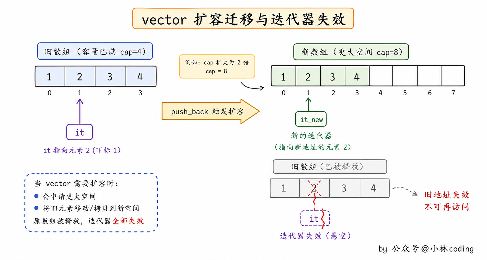
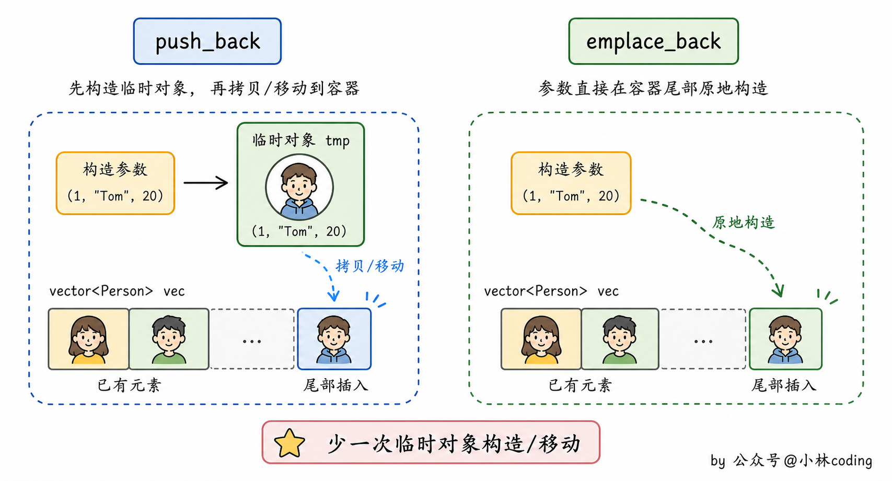
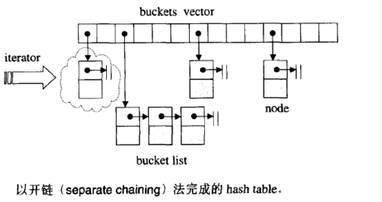
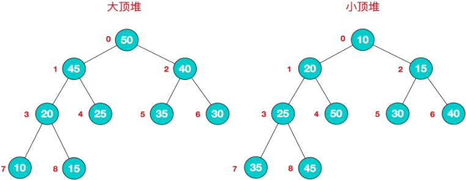
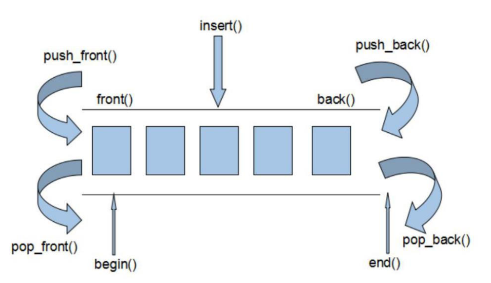
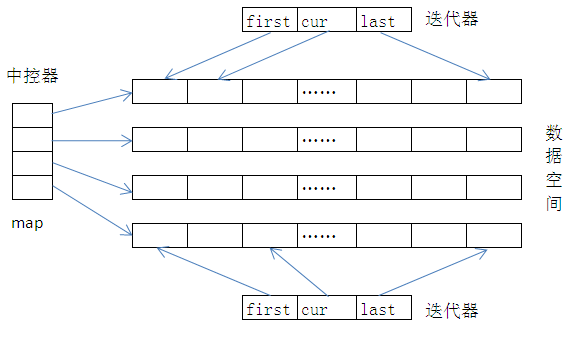
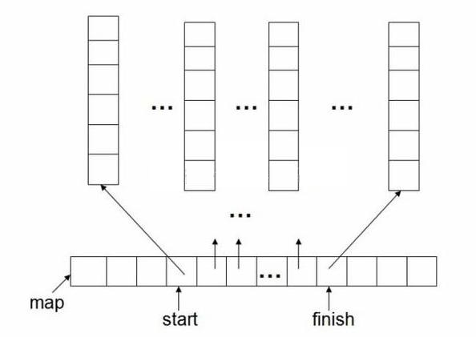
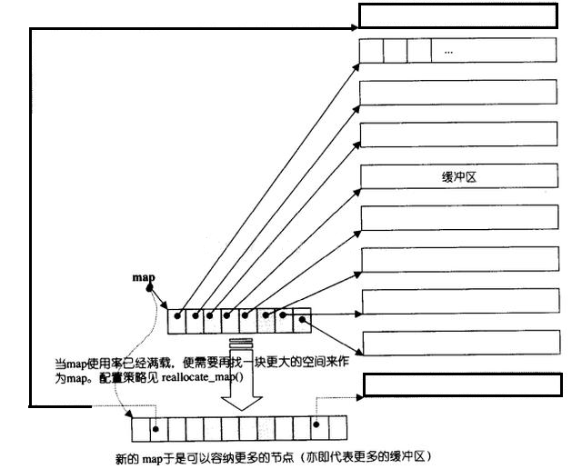

> 本笔记整理自小林coding《C++面试题》（https://xiaolincoding.com/interview/cpp.html），用于个人复习与分享，如涉侵权请联系删除。

# C++ STL 笔记

本类覆盖 STL 各类容器（vector、deque、list、map、unordered_map 等）的底层结构、迭代器失效规则、一边遍历一边增删的注意事项，以及 priority_queue 与 std::sort 的底层实现。

### （导语）STL 容器分类

- **STL 的定位**：C++ STL（标准模板库）提供了多种容器，用于存储和管理数据。
- **三大分类**：这些容器可分为序列式容器、关联式容器和容器适配器三大类，各自适用于不同场景。

### vector 中 push_back 和 emplace_back 的区别？

- **push_back**：向容器尾部添加元素时，首先会创建这个元素，然后再将这个元素拷贝或者移动到容器中。
- **push_back 的额外开销**：如果是拷贝的话，事后会自行销毁先前创建的这个元素。
- **emplace_back**：在实现时，则是直接在容器尾部创建这个元素，省去了拷贝或移动元素的过程。



### C++ 的 map 是线程安全的么？

- **结论**：不是线程安全的。
- **风险**：如果多个线程同时对 `std::map` 进行操作（尤其是写操作，如插入、删除、修改元素），可能会导致未定义行为，例如数据损坏、迭代器失效、程序崩溃等。
- **并发写操作**：多个线程同时执行插入（`insert`）、删除（`erase`）或修改（如 `operator[]` 赋值）时，会破坏 `std::map` 内部的红黑树结构（有序关联容器的底层实现），导致数据错乱。
- **读写并发**：即使一个线程读、另一个线程写，也可能出现问题。
- **读写并发的例子**：读线程正在遍历 map 时，写线程修改了结构，可能导致读线程的迭代器失效，触发不可预知的错误。
- **无内置同步机制**：`std::map` 没有提供任何锁（如互斥量）或原子操作来保证多线程安全，所有同步逻辑需要开发者手动实现。
- **方案一（加锁保护）**：使用 `std::mutex` 或 `std::lock_guard` 等同步工具，确保同一时间只有一个线程能访问或修改 map。

```
#include <map>
#include <mutex>

std::map<int, int> my_map;
std::mutex mtx;  // 互斥锁

// 线程安全的插入操作
void safe_insert(int key, int value) {
    std::lock_guard<std::mutex> lock(mtx);  // 自动加锁/解锁
    my_map[key] = value;
}

// 线程安全的查找操作
int safe_find(int key) {
    std::lock_guard<std::mutex> lock(mtx);
    auto it = my_map.find(key);
    return (it != my_map.end()) ? it->second : -1;
}

```

- **方案二（线程安全的替代容器）**：C++ 标准库本身并未提供线程安全的 map / unordered_map，但第三方库提供了线程安全的哈希表或映射容器，可减少手动加锁的开销。
- **第三方库举例**：Intel TBB 的 `concurrent_hash_map` / `concurrent_unordered_map`、folly 的并发容器等。

### unordered_map 的底层结构是什么？

- **底层结构**：`std::unordered_map` 的底层结构基于哈希表实现。
- **哈希桶数组**：`std::unordered_map` 内部维护了一个哈希桶数组，数组中的每个元素称为一个哈希桶。
- **桶内存储**：每个哈希桶可以存储一个或多个键值对。
- **哈希冲突**：当多个键通过哈希函数计算得到相同的索引时，就会发生哈希冲突。
- **冲突解决方式**：`std::unordered_map` 通常使用链地址法来解决哈希冲突。
- **链地址法**：在链地址法中，每个哈希桶是一个链表，当发生哈希冲突时，新的键值对会被插入到对应的链表或容器中。


### C++ 容器可以一边遍历一边插入吗？

- **总体原则**：当处理 vector、string、deque 时，当在一个循环中可能增加或移除元素时，要考虑到迭代器可能会失效的问题。
- **vector 插入（end 失效）**：当插入（`push_back`）一个元素后，end 操作返回的迭代器肯定失效。
- **vector 插入（容量变化）**：当插入（`push_back`）一个元素后，如果 vector 的 capacity 发生了改变，则需要重新加载整个容器，此时 first 和 end 操作返回的迭代器都会失效。
- **list 插入**：插入操作（`insert`）和接合操作（`splice`）不会造成原有的 list 迭代器失效。
- **deque 头尾插入**：在 deque 容器首部或者尾部插入元素，不会使得任何迭代器失效。
- **deque 其他位置**：在 deque 容器的任何其他位置进行插入或删除操作，都将使指向该容器元素的所有迭代器失效。
- **set 和 map 插入**：与 list 相同，当对其进行 `insert` 或者 `erase` 操作时，操作之前的所有迭代器，在操作完成之后都依然有效。
- **set 和 map 的例外**：被删除元素的迭代器失效。

### 使用迭代器怎么删除一个元素？

- **顺序容器（vector、deque）的失效范围**：`erase` 迭代器不仅使所指向被删除的迭代器失效，而且使被删元素之后的所有迭代器失效（list 除外）。
- **顺序容器的禁用写法**：因为上述失效范围，所以不能使用 `erase(it++)` 的方式。
- **顺序容器的正确做法**：`erase` 的返回值是下一个有效迭代器，要写成 `It = c.erase(it);`。

```
std::vector<int> arrayInt;
...
std::vector<int>::iterator it = arrayInt.begin();
while (it != arrayInt.end())
{
    if (...)
    {
        // 需要注意的是，因为顺序式容器会使本身和后面的元素迭代器都失效，所以不能简单的++操作
        // 顺序式容器的erase()会返回紧随被删除元素的下一个元素的有效迭代器（节点式容器的erase()的返回值是void）
        it = arrayInt.erase(it);
    }
    else
    {
        it++;
    }
}

```

- **关联容器（map、set、multimap、multiset）的失效范围**：`erase` 迭代器只是被删除元素的迭代器失效。
- **关联容器的返回值**：关联式容器的 `erase()` 的返回值是 void，所以要采用 `erase(it++)` 的方式删除迭代器。

```
std::map<int, struct> mapInfo;
...
std::map<int, struct>::iterator it = mapInfo.begin();
while (it != mapInfo.end())
{
    if (...)
    {
        // 删除节点的前，对迭代器进行后移的操作，因为其他元素不会失效
        mapInfo.erase(it++);
    }
    else
    {
        it++;
    }
}

```


### STL 迭代器的失效情况你知道哪些？

- **vector 插入（扩容）**：当在 vector 中插入元素时，如果插入操作导致容器的内存重新分配（即插入后容器的容量不足，需要重新分配更大的内存空间），那么所有指向 vector 的迭代器、指针和引用都会失效。
- **vector 插入（扩容的原因）**：因为重新分配内存后，元素会被移动到新的内存位置。

```
#include <iostream>
#include <vector>

int main() {
    std::vector<int> vec = {1, 2, 3};
    auto it = vec.begin();
    vec.push_back(4); // 可能导致内存重新分配
    // 此时 it 可能已经失效
    // std::cout << *it << std::endl; // 未定义行为
    return 0;
}

```

- **vector 删除元素**：当在 vector 中删除元素时，指向被删除元素的迭代器、指针和引用会失效。
- **vector 删除（后半部分）**：并且指向删除位置之后的元素的迭代器、指针和引用也会失效。

```
#include <iostream>
#include <vector>

int main() {
    std::vector<int> vec = {1, 2, 3};
    auto it = vec.begin() + 1;
    vec.erase(vec.begin()); // 删除第一个元素
    // 此时 it 失效
    // std::cout << *it << std::endl; // 未定义行为
    return 0;
}

```

- **deque 中间插入**：在 deque 的中间插入元素时，所有迭代器、指针和引用都会失效。
- **deque 头尾插入**：在 deque 的头部或尾部插入元素时，指向元素的迭代器、指针和引用不会失效。
- **deque 头尾插入的例外**：但如果插入操作导致内存重新分配，那么迭代器可能会失效。

```
#include <iostream>
#include <deque>

int main() {
    std::deque<int> deq = {1, 2, 3};
    auto it = deq.begin() + 1;
    deq.insert(deq.begin() + 1, 4); // 在中间插入元素
    // 此时 it 失效
    // std::cout << *it << std::endl; // 未定义行为
    return 0;
}

```

- **deque 中间删除**：删除 deque 中间的元素时，所有迭代器、指针和引用都会失效。
- **deque 头尾删除**：删除 deque 头部或尾部的元素时，指向被删除元素的迭代器、指针和引用会失效。

```
#include <iostream>
#include <deque>

int main() {
    std::deque<int> deq = {1, 2, 3};
    auto it = deq.begin() + 1;
    deq.erase(deq.begin() + 1); // 删除中间元素
    // 此时 it 失效
    // std::cout << *it << std::endl; // 未定义行为
    return 0;
}

```

- **set 插入**：set 在插入元素不会使任何迭代器、指针和引用失效。
- **set 插入不失效的原因**：因为关联式容器使用红黑树等平衡二叉搜索树实现，插入操作只是在树中添加新节点，不会影响其他节点的内存位置。
- **set 删除**：指向被删除元素的迭代器、指针和引用会失效，其他迭代器、指针和引用不会失效。

```
#include <iostream>
#include <set>

int main() {
    std::set<int> s = {1, 2, 3};
    auto it = s.begin();
    auto it_to_delete = s.find(2);
    s.erase(it_to_delete);
    // 此时 it_to_delete 失效
    // std::cout << *it_to_delete << std::endl; // 未定义行为
    std::cout << *it << std::endl; // 正常输出
    return 0;
}

```

- **map 插入**：map 在插入元素不会使任何迭代器、指针和引用失效，原因与 set 相同。
- **map 删除**：指向被删除元素的迭代器、指针和引用会失效，其他迭代器、指针和引用不会失效。

```
#include <iostream>
#include <map>

int main() {
    std::map<int, int> m = {{1, 10}, {2, 20}, {3, 30}};
    auto it = m.begin();
    auto it_to_delete = m.find(2);
    m.erase(it_to_delete);
    // 此时 it_to_delete 失效
    // std::cout << it_to_delete->second << std::endl; // 未定义行为
    std::cout << it->second << std::endl; // 正常输出
    return 0;
}

```

- **list 插入**：在 list 插入元素不会使任何迭代器、指针和引用失效。
- **list 插入不失效的原因**：因为链表的插入操作只是修改节点的指针，不会影响其他节点的内存位置。
- **list 删除**：指向被删除元素的迭代器、指针和引用会失效，其他迭代器、指针和引用不会失效。

```
#include <iostream>
#include <list>

int main() {
    std::list<int> lst = {1, 2, 3};
    auto it = lst.begin();
    auto it_to_delete = ++lst.begin();
    lst.erase(it_to_delete);
    // 此时 it_to_delete 失效
    // std::cout << *it_to_delete << std::endl; // 未定义行为
    std::cout << *it << std::endl; // 正常输出
    return 0;
}

```


### STL 容器中优先级队列 priority_queue 的底层原理

- **底层容器**：`priority_queue` 底层采用 vector 或 deque 容器存储数据。
- **堆结构**：`priority_queue` 优先级队列之所以总能保证优先级最高的元素位于队头，最重要的原因是其底层采用堆数据结构存储结构。
- **两者并不冲突**：vector 和 deque 是用来存储元素的容器，而堆是一种数据结构，其本身无法存储数据，只能依附于某个存储介质，辅助其组织数据存储的先后次序。
- **为什么还要堆**：由于 vector 或 deque 容器并没有提供实现 `priority_queue` 容器适配器「First in, Largest out」特性的功能，因此 STL 选择使用堆来重新组织 vector 或 deque 容器中存储的数据，从而实现该特性。
- **堆的基础**：简单的理解堆，它是在完全二叉树的基础上，要求树中所有的父节点和子节点之间，都要满足既定的排序规则。
- **大顶堆**：如果排序规则为从大到小排序，则表示堆的完全二叉树中，每个父节点的值都要不小于子节点的值，这种堆通常称为大顶堆。
- **小顶堆**：如果排序规则为从小到大排序，则表示堆的完全二叉树中，每个父节点的值都要不大于子节点的值，这种堆通常称为小顶堆。
- **同层次序不保证**：但需要注意的是，无论是大顶堆还是小顶堆，同一父节点下子节点的次序是不做规定的。
- **整体依然无序**：这也是经大顶堆或小顶堆组织后的数据整体依然无序的原因。
- **核心价值**：可以确定的一点是，无论是通过大顶堆或者小顶堆，总可以筛选出最大或最小的那个元素（优先级最大），并将其移至序列的开头，此功能也正是 `priority_queue` 容器适配器所需要的。


### 双向队列底层是如何实现的？

- **三者的底层差异**：vector 底层采用的是动态数组实现，list 底层是双向链表，而 deque 则是前两者的折中。
- **折中的含义**：deque 既不像 vector 那样完全连续，也不像 list 那样完全离散。
- **list 的实现细节**：C++ 标准只规定了双向链表的行为，libstdc++ 的具体实现采用带哨兵节点的循环双向链表，这属于实现细节。
- **能力对比**：vector 支持随机访问，list 支持任意位置常量时间的插入或删除，deque 则支持随机访问以及首尾元素的快速插入删除。
- **与 vector 的最大差异一**：deque 允许常数时间内对起头端进行元素的插入和删除。
- **与 vector 的最大差异二**：deque 没有所谓的容量概念，因为它是以分段连续空间组合而成，随时可以增加一段新的空间并连接起来。
- **无需整体搬移**：像 vector 那样因旧空间不足而重新配置更大空间、复制元素、释放原空间的事情，deque 是不会出现的。
- **无需空间保留**：也因此，deque 不需要提供所谓的空间保留。
- **整体结构**：双端队列 deque 是一种双向开口的存储空间分段连续的数据结构，每段数据空间内部是连续的，而每段数据空间之间则不一定连续。
- **空间来源**：这些空间都是程序运行过程中在堆上动态分配的。
- **中控器**：中控器（或叫 map）保存着一组指针，每个指针指向一段数据空间的起始位置，通过中控器可以找到所有的数据空间。
- **中控器扩容**：如果中控器的数据空间满了，会重新申请一块更大的空间，并将中控器的所有指针拷贝到新空间中。
- **动态拼接**：一旦有必要在 deque 的前端或尾端增加新空间，便配置一段连续空间，串接在整个 deque 的头部或尾部。
- **缓冲区**：deque 采用一块所谓的 map（不是 STL 的 map 容器）作为主控，这里的 map 也是一块连续空间，其中每个元素为一个节点（也是 deque 的迭代器），指向另一段较大的连续线性空间，称为缓冲区。
- **存储主体**：缓冲区才是 deque 的储存空间主体。





### std::sort 的底层是怎么实现的？

- **算法构成**：`std::sort` 主要是三种算法的结合体，分别是插入排序、快速排序、堆排序。
- **插入排序的复杂度**：时间复杂度 O(N²)。
- **插入排序的优缺点**：优点是当数据量很少时效率比较高，缺点是当数据量比较大时时间复杂度比较高。
- **快速排序的复杂度**：平均 O(N·logN)，最坏 O(N²)。
- **快速排序的优缺点**：优点是大部分时候性能比较好，缺点是算法时间复杂度不稳定，数据量大时递归深度很大，影响程序工作效率。
- **堆排序的复杂度**：时间复杂度 O(N·logN)。
- **堆排序的优缺点**：优点是算法时间复杂度稳定且比较小，适合数据量比较大的排序，缺点是堆排序在建堆和调整堆的过程中会产生比较大的开销，数据量少的时候不适用。
- **整体策略**：`std::sort` 根据上文提到的几种算法的优缺点，对排序算法进行整合，libstdc++ 的实现为 introsort，即内省式排序。
- **主体仍是快速排序**：先以快速排序的方式不断二分区间。
- **递归深度超限时切换为堆排序**：当某次递归深度超过 2 * log2(N) 时，说明快速排序有退化为 O(N²) 的风险，于是把这个子区间交给堆排序来处理，保证整体最坏时间复杂度稳定在 O(N·logN)。
- **小区间留给最后的插入排序**：当子区间长度 ≤ _S_threshold（libstdc++ 中取 16）时，暂时不对其排序，而是留到最后。
- **收尾阶段**：整个数组大部分元素已经「接近有序」，这时再做一次插入排序就能以 O(N) 级别的代价完成收尾，最终得到完全有序的结果。
- **分治思维**：`std::sort` 采用的是分治思维，先采用快速排序，将整个区域分成多个子区域，每个子区域内部根据数据量采用不同算法。
- **合并结果**：分治后，各个子区域局部有序后再通过整个区域进行排序。

## 速记要点

1. `push_back` 先创建元素再拷贝或移动到容器，`emplace_back` 直接在容器尾部原地构造，省去一次拷贝或移动。
2. `std::map` 不是线程安全的，并发写会破坏底层红黑树结构，读写并发也可能让读线程的迭代器失效，需要自己用 `std::mutex` 加锁或改用第三方并发容器。
3. `unordered_map` 底层是哈希表，内部维护哈希桶数组，冲突用链地址法解决，冲突的键值对挂在同一个桶的链表上。
4. 一边遍历一边增删之前要先判断迭代器会不会失效，vector 的 `end()` 在 `push_back` 后一定失效，capacity 发生变化时 `first` 和 `end` 都失效。
5. 顺序容器（vector、deque）删除要用 `it = c.erase(it);` 承接返回的下一个有效迭代器，关联容器（map、set）`erase` 返回 void，要用 `c.erase(it++);`。
6. vector 插入一旦触发扩容，所有迭代器、指针、引用全部失效，删除元素则被删位置及其之后的迭代器、指针、引用全部失效。
7. deque 头尾插入不失效、中间插入和删除让所有迭代器失效，list 与 set、map 的插入都不使任何迭代器失效，只有被删除元素的迭代器失效。
8. `priority_queue` 用 vector 或 deque 存数据、用堆组织次序，大顶堆每个父节点不小于子节点、小顶堆每个父节点不大于子节点，二者只保证堆顶是极值、整体无序。
9. deque 是分段连续的双向开口结构，靠中控器（map）里的指针数组指向各段缓冲区，因此没有容量概念，也不会像 vector 那样搬移全部元素。
10. `std::sort` 是 introsort，主体快速排序，递归深度超过 2 * log2(N) 时切换为堆排序兜底 O(N·logN)，子区间长度 ≤ 16 时留给最后的插入排序收尾。
